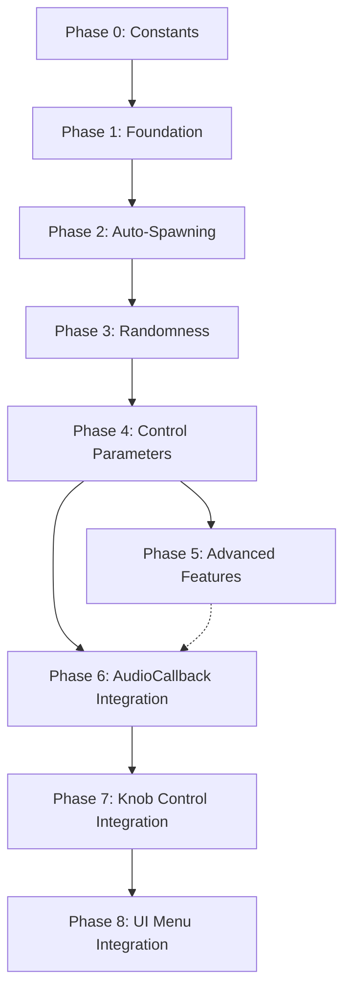

# Granular Synthesis Implementation Plan for SimpleSampler

> **NOTE:** This plan has been reorganized into separate files for easier implementation.
> 
> **Main Plan:** See [`plans/granular-synth-main.md`](plans/granular-synth-main.md) for overview and phase summaries.
> 
> **Individual Phases:** Each phase has its own detailed plan file:
> - [`plans/granular-phase0-constants.md`](plans/granular-phase0-constants.md) - Add granular constants
> - [`plans/granular-phase1-foundation.md`](plans/granular-phase1-foundation.md) - Foundation (grain data structures, pool, spawning)
> - [`plans/granular-phase2-autospawning.md`](plans/granular-phase2-autospawning.md) - Auto-spawning logic
> - [`plans/granular-phase3-randomness.md`](plans/granular-phase3-randomness.md) - Randomness for organic sound
> - [`plans/granular-phase4-control-parameters.md`](plans/granular-phase4-control-parameters.md) - Control parameters
> - [`plans/granular-phase5-advanced-features.md`](plans/granular-phase5-advanced-features.md) - Advanced features (envelope, freeze, presets)
> - [`plans/granular-phase6-audiocallback-integration.md`](plans/granular-phase6-audiocallback-integration.md) - AudioCallback integration
> - [`plans/granular-phase7-knob-integration.md`](plans/granular-phase7-knob-integration.md) - Knob control mapping
> - [`plans/granular-phase8-ui-menu-integration.md`](plans/granular-phase8-ui-menu-integration.md) - UI menu integration

---

## Overview

### What is Granular Synthesis?

Granular synthesis breaks audio into tiny fragments called "grains" (typically 1-50 milliseconds), then recombines them to create new sounds. Each grain is a short snippet of audio that's shaped by an envelope to prevent clicks.

### Key Concepts

| Concept | Description | Typical Values |
|----------|-------------|----------------|
| **Grain Size** | Duration of each grain | 1-50ms |
| **Grain Density** | How many grains per second | 10-200 grains/sec |
| **Position** | Where in source audio to read from | 0 to buffer length |
| **Pitch** | Playback speed of each grain | 0.5x to 2.0x (±1 octave) |
| **Envelope** | Shape of grain (fade in/out) | Gaussian, Hanning, etc. |

### Comparison: SimpleSampler vs Granular

**SimpleSampler (Current):**
- One ticker per sample file
- Plays from START → END
- One continuous playback per sample

**Granular Synthesis (New):**
- Multiple grains (tickers) referencing the SAME WAV file
- Each grain starts at a RANDOM position
- Each grain has its own duration and pitch
- Multiple grains play simultaneously

---

## Key Changes from Original Plan

1. **Reduced MAX_GRAINS to 8** - For embedded system memory safety
2. **Added AudioCallback integration** - Phase 6 handles routing granular audio
3. **Added knob control integration** - Phase 7 maps knobs to parameters
4. **Added UI menu integration** - Phase 8 creates granular parameter menus
5. **Fixed grain lifecycle management** - Properly checks `finished_` flag after `tick()`
6. **Removed redundant spawnInterval_** - Using `spawnRate_` instead
7. **Leveraged b3WavTicker's built-in envelope methods** - `env_volume()` and `env_volume2()`

---

## Implementation Order

---

## Next Steps

- [ ] **Read [`plans/granular-synth-main.md`](plans/granular-synth-main.md)** for overview
- [ ] **Implement Phase 0** to add constants
- [ ] **Implement Phase 1** to verify basic grain playback works
- [ ] **Add Phase 2** for continuous granular texture
- [ ] **Experiment with Phase 3** randomness values
- [ ] **Map controls in Phase 4** for real-time manipulation
- [ ] **Integrate AudioCallback in Phase 6** to enable granular mode
- [ ] **Add knob control in Phase 7** for real-time parameter tweaking
- [ ] **Create UI menus in Phase 8** for visual parameter control
- [ ] **Add Phase 5** features as needed for your sound design goals

---

## Tips and Best Practices

### Performance
- Limit `MAX_GRAINS` to 8 for embedded safety (can increase later if needed)
- Use envelope to prevent clicks at grain boundaries
- Scale volume by `1.0 / activeGrainCount_` to prevent clipping

### Sound Design
- Start with small `grainDuration` (10-50ms) for texture
- Use `spawnRate` of 20-50 grains/sec for dense textures
- Add randomness gradually (start with 0, increase slowly)
- Use `freezeMode` for ambient pads and drones

### Debugging
- Monitor `activeGrainCount_` to see how many grains are playing
- Test with single grain first, then increase density
- Use display to show current granular parameters
