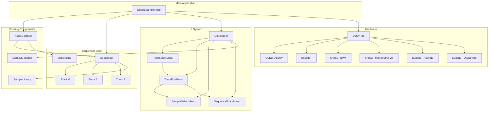
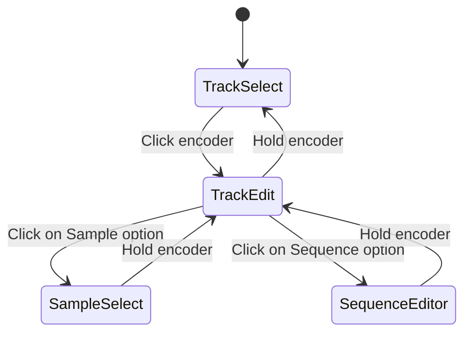

# 16-Step Sequencer Architecture

## Overview

This document describes the architecture for a 16-step sequencer system for the Daisy SimpleSampler project. The sequencer supports 3 independent tracks, each with sample selection and a 16-step pattern, tempo control, and a synthesized metronome.

## Architecture Overview Diagram



## Data Structures

### Constants

```cpp
// Sequencer Configuration
#define NUM_STEPS 16
#define NUM_TRACKS 3
#define MIN_BPM 60
#define MAX_BPM 180

// Display Configuration
#define DISPLAY_WIDTH 128
#define DISPLAY_HEIGHT 64
#define FONT_7x10_HEIGHT 10
#define FONT_6x8_HEIGHT 8
```

### Track Structure

```cpp
struct Track {
    // Sample Assignment
    int sampleIndex;              // Index into SampleLibrary (-1 = none assigned)
    char sampleName[32];          // Cached sample name for display

    // Step Pattern (16 steps, each can be active/inactive)
    bool steps[NUM_STEPS];

    // Playback State
    b3WavTicker ticker;          // Independent ticker for polyphonic playback
    bool isPlaying;              // Is this track currently playing?

    // Track Properties
    float volume;                // Track volume (0.0 - 1.0)
    bool mute;                   // Track mute state
    bool solo;                   // Track solo state

    // Initialization
    void init() {
        sampleIndex = -1;
        sampleName[0] = '\0';
        for (int i = 0; i < NUM_STEPS; i++) {
            steps[i] = false;
        }
        isPlaying = false;
        volume = 1.0f;
        mute = false;
        solo = false;
    }
};
```

### Sequencer State

```cpp
struct SequencerState {
    // Timing
    int bpm;                     // Current tempo (60-180)
    int currentStep;             // Current step position (0-15)
    uint32_t stepStartTime;      // Timestamp when current step started
    uint32_t samplesPerStep;     // Number of audio samples per step
    bool isRunning;              // Sequencer running state

    // Track Data
    Track tracks[NUM_TRACKS];

    // Metronome
    bool metronomeEnabled;       // Metronome on/off
    float metronomeVolume;       // Metronome volume (0.0 - 1.0)

    // Initialization
    void init() {
        bpm = 120;               // Default BPM
        currentStep = 0;
        stepStartTime = 0;
        samplesPerStep = 0;
        isRunning = false;
        metronomeEnabled = true;
        metronomeVolume = 0.5f;

        for (int i = 0; i < NUM_TRACKS; i++) {
            tracks[i].init();
        }
    }
};
```

### UI Screen Types

```cpp
enum class ScreenType {
    TrackSelect,      // List all 3 tracks for selection
    TrackEdit,        // Edit selected track (sample/sequence options)
    SampleSelect,     // Choose sample for track
    SequenceEditor    // Edit 16-step pattern
};
```

### UI State

```cpp
struct UIState {
    // Current Screen
    ScreenType currentScreen;
    ScreenType previousScreen;   // For navigation stack

    // Selection State
    int selectedTrack;           // Currently selected track index (0-2)
    int selectedStep;            // Currently selected step (0-15)
    int selectedSample;          // Currently selected sample index
    int windowStart;             // For scrolling sample list

    // Navigation State
    bool encoderPressed;         // Track encoder press state
    uint32_t encoderPressTime;   // For detecting long press (hold)
    bool encoderHeld;            // Encoder is being held

    // Display Update Timing
    uint32_t lastDisplayUpdate;
    bool displayDirty;           // Flag to trigger display refresh

    // Initialization
    void init() {
        currentScreen = ScreenType::TrackSelect;
        previousScreen = ScreenType::TrackSelect;
        selectedTrack = 0;
        selectedStep = 0;
        selectedSample = 0;
        windowStart = 0;
        encoderPressed = false;
        encoderPressTime = 0;
        encoderHeld = false;
        lastDisplayUpdate = 0;
        displayDirty = true;
    }
};
```

## Class Hierarchy

### Sequencer Class

```cpp
/**
 * Sequencer - Core timing and step logic
 *
 * Manages the sequencer clock, step advancement, and track triggering.
 * Integrates with SampleLibrary for sample playback.
 */
class Sequencer {
private:
    SequencerState state_;
    SampleLibrary* sampleLibrary_;
    int sampleRate_;

    // Calculate samples per step based on BPM
    uint32_t calculateSamplesPerStep(int bpm, int sampleRate);

    // Check if step should trigger for a track
    bool shouldTriggerTrack(int trackIndex, int step);

    // Trigger all active samples at current step
    void triggerStep(int step);

public:
    // Constructor
    Sequencer(SampleLibrary* sampleLibrary, int sampleRate);

    // Initialize sequencer
    void init();

    // Start/stop sequencer
    void start();
    void stop();
    void toggle();

    // Set BPM
    void setBPM(int bpm);
    int getBPM() const { return state_.bpm; }

    // Process audio callback (called from AudioCallback)
    void processAudio(float** out, size_t size);

    // Advance step (called when timing threshold reached)
    void advanceStep();

    // Get current step
    int getCurrentStep() const { return state_.currentStep; }

    // Get track reference
    Track* getTrack(int index);
    const Track* getTrack(int index) const;

    // Get sequencer state
    const SequencerState& getState() const { return state_; }

    // Metronome control
    void setMetronomeVolume(float volume);
    float getMetronomeVolume() const { return state_.metronomeVolume; }
    void toggleMetronome();
};
```

### Metronome Class

```cpp
/**
 * Metronome - Synthesized click/beep using daisysp oscillator
 *
 * Generates a simple click sound synchronized with sequencer steps.
 * Uses a sine or square wave oscillator with envelope for short decay.
 */
class Metronome {
private:
    daisysp::Oscillator osc_;    // Oscillator for click sound
    daisysp::Adsr env_;           // Envelope for short decay
    float volume_;                // Output volume (0.0 - 1.0)
    bool active_;                 // Currently playing a click
    float frequency_;            // Click frequency (Hz)

public:
    // Constructor
    Metronome();

    // Initialize metronome
    void init(float sampleRate);

    // Trigger a click
    void trigger();

    // Set volume
    void setVolume(float volume);
    float getVolume() const { return volume_; }

    // Set frequency
    void setFrequency(float freq);

    // Process audio (mix into output buffers)
    void processAudio(float** out, size_t size);

    // Check if currently playing
    bool isActive() const { return active_; }
};
```

### UIManager Class

```cpp
/**
 * UIManager - Handles UI navigation and display rendering
 *
 * Manages the menu system, processes encoder/button input,
 * and renders all screens to the OLED display.
 */
class UIManager {
private:
    DisplayManager& display_;
    DaisyPod& hw_;
    UIState state_;
    Sequencer* sequencer_;
    SampleLibrary* sampleLibrary_;

    // Menu instances
    TrackSelectMenu trackSelectMenu_;
    TrackEditMenu trackEditMenu_;
    SampleSelectMenu sampleSelectMenu_;
    SequenceEditorMenu sequenceEditorMenu_;

    // Process encoder input
    void processEncoder();

    // Process button input
    void processButtons();

    // Process knob input
    void processKnobs();

    // Navigate to screen
    void navigateTo(ScreenType screen);

    // Return to previous screen
    void goBack();

public:
    // Constructor
    UIManager(DisplayManager& display, DaisyPod& hw,
              Sequencer* sequencer, SampleLibrary* sampleLibrary);

    // Initialize UI
    void init();

    // Update UI (called from main loop)
    void update();

    // Render current screen
    void render();

    // Get UI state
    const UIState& getState() const { return state_; }
};
```

### Base Menu Class

```cpp
/**
 * BaseMenu - Abstract base class for all menu screens
 *
 * Defines the interface that all menu screens must implement.
 */
class BaseMenu {
protected:
    UIManager* uiManager_;
    DisplayManager& display_;
    Sequencer* sequencer_;
    SampleLibrary* sampleLibrary_;

public:
    // Constructor
    BaseMenu(UIManager* uiManager, DisplayManager& display,
             Sequencer* sequencer, SampleLibrary* sampleLibrary);

    // Virtual destructor
    virtual ~BaseMenu() = default;

    // Render the menu screen
    virtual void render() = 0;

    // Handle encoder rotation
    virtual void handleEncoder(int increment) = 0;

    // Handle encoder click
    virtual void handleEncoderClick() = 0;

    // Handle encoder hold (long press)
    virtual void handleEncoderHold() = 0;

    // Handle button presses
    virtual void handleButton1() = 0;
    virtual void handleButton2() = 0;
};
```

### TrackSelectMenu Class

```cpp
/**
 * TrackSelectMenu - Screen to select a track for editing
 *
 * Displays all 3 tracks with their current sample assignment.
 * Encoder navigates between tracks, click enters track edit.
 */
class TrackSelectMenu : public BaseMenu {
private:
    int selectedIndex_;  // Currently selected track (0-2)

public:
    // Constructor
    TrackSelectMenu(UIManager* uiManager, DisplayManager& display,
                    Sequencer* sequencer, SampleLibrary* sampleLibrary);

    // Render track list
    void render() override;

    // Navigate between tracks
    void handleEncoder(int increment) override;

    // Enter track edit
    void handleEncoderClick() override;

    // No action for hold on this screen
    void handleEncoderHold() override;

    // No action for buttons on this screen
    void handleButton1() override;
    void handleButton2() override;
};
```

### TrackEditMenu Class

```cpp
/**
 * TrackEditMenu - Screen to edit track settings
 *
 * Shows options for the selected track:
 * - Sample (enter sample selection)
 * - Sequence (enter sequence editor)
 * - Mute/Solo toggles
 */
class TrackEditMenu : public BaseMenu {
private:
    enum class Option {
        Sample,
        Sequence,
        Mute,
        Solo,
        Back
    };

    Option selectedOption_;  // Currently selected option

public:
    // Constructor
    TrackEditMenu(UIManager* uiManager, DisplayManager& display,
                  Sequencer* sequencer, SampleLibrary* sampleLibrary);

    // Render track options
    void render() override;

    // Navigate between options
    void handleEncoder(int increment) override;

    // Enter selected option
    void handleEncoderClick() override;

    // Go back to track select
    void handleEncoderHold() override;

    // Toggle mute/solo
    void handleButton1() override;  // Toggle mute
    void handleButton2() override;  // Toggle solo
};
```

### SampleSelectMenu Class

```cpp
/**
 * SampleSelectMenu - Screen to select a sample for a track
 *
 * Lists available samples from SampleLibrary.
 * Supports scrolling for large sample lists.
 */
class SampleSelectMenu : public BaseMenu {
private:
    int selectedIndex_;      // Currently selected sample
    int windowStart_;        // First sample visible in window
    static const int ITEMS_PER_SCREEN = 4;  // Samples shown at once

    // Update window for scrolling
    void updateWindow();

public:
    // Constructor
    SampleSelectMenu(UIManager* uiManager, DisplayManager& display,
                     Sequencer* sequencer, SampleLibrary* sampleLibrary);

    // Render sample list
    void render() override;

    // Navigate between samples
    void handleEncoder(int increment) override;

    // Select sample and assign to track
    void handleEncoderClick() override;

    // Go back to track edit
    void handleEncoderHold() override;

    // No action for buttons on this screen
    void handleButton1() override;
    void handleButton2() override;
};
```

### SequenceEditorMenu Class

```cpp
/**
 * SequenceEditorMenu - Screen to edit 16-step pattern
 *
 * Displays 16 steps in a grid layout.
 * Current step is highlighted.
 * Encoder selects step, buttons activate/deactivate.
 */
class SequenceEditorMenu : public BaseMenu {
private:
    int selectedStep_;       // Currently selected step (0-15)
    static const int STEPS_PER_ROW = 8;  // 8 steps per row (2 rows)

public:
    // Constructor
    SequenceEditorMenu(UIManager* uiManager, DisplayManager& display,
                      Sequencer* sequencer, SampleLibrary* sampleLibrary);

    // Render step grid
    void render() override;

    // Navigate between steps
    void handleEncoder(int increment) override;

    // No action for click on this screen
    void handleEncoderClick() override;

    // Go back to track edit
    void handleEncoderHold() override;

    // Activate selected step
    void handleButton1() override;

    // Deactivate selected step
    void handleButton2() override;
};
```

## Integration Points

### Integration with SampleLibrary

The Sequencer class maintains a reference to SampleLibrary for:
- Loading sample metadata for display
- Getting sample audio data for playback
- Creating b3WavTicker instances for each track

**Integration Points:**
1. `Sequencer::Sequencer(SampleLibrary* sampleLibrary, ...)` - Constructor receives SampleLibrary reference
2. `Sequencer::triggerStep(int step)` - Calls `SampleLibrary::getSample()` to retrieve sample data
3. Track initialization - Creates b3WavTicker using `SampleInfo::reader.createWavTicker()`

### Integration with DisplayManager

The UIManager and all menu classes use DisplayManager for:
- Clearing the display
- Drawing text at specific positions
- Updating the display buffer

**Integration Points:**
1. `UIManager::UIManager(DisplayManager& display, ...)` - Constructor receives DisplayManager reference
2. All menu render methods call `DisplayManager::clear()`, `setCursor()`, `writeString()`, `update()`

### Integration with AudioCallback

The AudioCallback in SimpleSampler.cpp is modified to:
- Call `Sequencer::processAudio()` instead of `SampleLibrary::processAudio()`
- The Sequencer internally handles both track samples and metronome

**Modified AudioCallback:**
```cpp
void AudioCallback(AudioHandle::InputBuffer in,
                   AudioHandle::OutputBuffer out,
                   size_t size)
{
    // Sequencer handles all audio generation
    sequencer->processAudio(out, size);
}
```

### Integration with Main Loop

The main loop in SimpleSampler.cpp is modified to:
- Remove existing button/knob sample trigger logic
- Call `UIManager::update()` each iteration
- Process encoder, buttons, and knobs through UIManager

**Modified Main Loop:**
```cpp
while(1) {
    uint32_t now = System::GetNow();
    hw.ProcessDigitalControls();

    // Update UI system
    uiManager.update();

    // Existing LED updates can remain
    hw.UpdateLeds();
}
```

## Timing/Clock Architecture

### BPM to Samples Per Step Calculation

The sequencer converts BPM to audio sample timing:

```cpp
samplesPerStep = (sampleRate * 60) / (bpm * 4)
```

**Explanation:**
- `sampleRate * 60` = samples per minute
- `bpm * 4` = quarter notes per minute (16th notes = 4 per quarter)
- Division gives samples per 16th note step

**Example at 120 BPM, 48 kHz sample rate:**
- `samplesPerStep = (48000 * 60) / (120 * 4) = 2,880,000 / 480 = 6,000 samples`

### Step Advancement in Audio Callback

The sequencer tracks step timing using sample counts:

```cpp
void Sequencer::processAudio(float** out, size_t size) {
    // Clear output buffers
    for (size_t i = 0; i < size; i++) {
        out[0][i] = 0.0f;
        out[1][i] = 0.0f;
    }

    // Check if we need to advance to next step
    uint32_t elapsedSamples = ...; // Track from last step
    if (elapsedSamples >= state_.samplesPerStep) {
        advanceStep();
    }

    // Process all active track samples
    for (int trackIdx = 0; trackIdx < NUM_TRACKS; trackIdx++) {
        Track& track = state_.tracks[trackIdx];
        if (!track.ticker.finished_) {
            // Use sample's reader to generate audio
            SampleInfo* sample = sampleLibrary_->getSample(track.sampleIndex);
            if (sample) {
                sample->reader.tick(&track.ticker, sample->dataSource,
                                   1.0, track.volume, size, out[0], out[1]);
            }
        }
    }

    // Process metronome if enabled
    if (state_.metronomeEnabled) {
        metronome_.processAudio(out, size);
    }
}
```

### Metronome Synchronization

The metronome triggers on every step:

```cpp
void Sequencer::advanceStep() {
    // Move to next step
    state_.currentStep = (state_.currentStep + 1) % NUM_STEPS;

    // Reset timing
    state_.stepStartTime = System::GetNow();

    // Trigger samples for active steps
    for (int trackIdx = 0; trackIdx < NUM_TRACKS; trackIdx++) {
        if (state_.tracks[trackIdx].steps[state_.currentStep]) {
            triggerTrack(trackIdx);
        }
    }

    // Trigger metronome click
    if (state_.metronomeEnabled) {
        metronome_.trigger();
    }
}
```

### Metronome Emphasis (Optional Enhancement)

For a more musical feel, the metronome could emphasize beats 1, 5, 9, 13:

```cpp
void Sequencer::advanceStep() {
    // ... existing code ...

    // Trigger metronome with emphasis on quarter notes
    if (state_.metronomeEnabled) {
        bool isQuarterNote = (state_.currentStep % 4 == 0);
        metronome_.trigger(isQuarterNote);
    }
}
```

## UI/Navigation Architecture

### Screen State Machine



### Navigation Stack

The UIManager maintains a simple navigation stack:

```cpp
struct UIState {
    ScreenType currentScreen;
    ScreenType previousScreen;
    // ...
};
```

**Navigation Logic:**
- `navigateTo(ScreenType)`: Sets `previousScreen = currentScreen`, then `currentScreen = newScreen`
- `goBack()`: Sets `currentScreen = previousScreen`

### Display Rendering Approach

Each screen has a dedicated `render()` method that:
1. Clears the display
2. Draws header (screen title)
3. Draws content (list, grid, etc.)
4. Draws footer (status info)
5. Calls `display.update()`

**Screen Layout Template:**
```
+----------------------------------+
| [HEADER - Screen Title]          | 0-9px (Font_7x10)
+----------------------------------+
|                                  |
| [CONTENT AREA]                   | 10-54px
|                                  |
+----------------------------------+
| [FOOTER - Status info]          | 55-63px (Font_6x8)
+----------------------------------+
```

### TrackSelectMenu Display

```
+----------------------------------+
| TRACK SELECT                     |
+----------------------------------+
| > Track 1: kick.wav              |
|   Track 2: snare.wav             |
|   Track 3: hihat.wav             |
+----------------------------------+
| BPM: 120 | Running               |
+----------------------------------+
```

### TrackEditMenu Display

```
+----------------------------------+
| TRACK 1 EDIT                     |
+----------------------------------+
| > Sample: kick.wav               |
|   Sequence                       |
|   Mute: OFF                      |
|   Solo: OFF                      |
|   Back                           |
+----------------------------------+
| Use encoder to select           |
+----------------------------------+
```

### SampleSelectMenu Display

```
+----------------------------------+
| SELECT SAMPLE                    |
+----------------------------------+
|   bass.wav                       |
| > clap.wav                       |
|   crash.wav                      |
|   hihat.wav                      |
+----------------------------------+
| 3/12                             |
+----------------------------------+
```

### SequenceEditorMenu Display

```
+----------------------------------+
| TRACK 1 SEQUENCE                 |
+----------------------------------+
| X X . . X X . . X X . . X X . . |
| . . X X . . X X . . X X . . X X |
+----------------------------------+
| Step: 5 | B1: ON | B2: OFF       |
+----------------------------------+

Legend:
X = Active step
. = Inactive step
^ = Current step (highlighted)
```

## Memory Considerations

### Track Data Storage

Track data is stored in RAM within the `SequencerState` structure:

```cpp
struct SequencerState {
    Track tracks[NUM_TRACKS];  // 3 tracks
    // ...
};
```

**Memory per Track:**
- `sampleIndex`: 4 bytes (int)
- `sampleName`: 32 bytes (char[32])
- `steps`: 16 bytes (bool[16])
- `ticker`: ~128 bytes (b3WavTicker with vector)
- `volume`: 4 bytes (float)
- `mute`, `solo`, `isPlaying`: 3 bytes (bool)
- **Total per track**: ~187 bytes
- **Total for 3 tracks**: ~561 bytes

### Sequencer State Memory

```cpp
struct SequencerState {
    Track tracks[NUM_TRACKS];        // ~561 bytes
    int bpm;                         // 4 bytes
    int currentStep;                 // 4 bytes
    uint32_t stepStartTime;          // 4 bytes
    uint32_t samplesPerStep;         // 4 bytes
    bool isRunning;                  // 1 byte
    bool metronomeEnabled;           // 1 byte
    float metronomeVolume;           // 4 bytes
    // Total: ~583 bytes
};
```

### UI State Memory

```cpp
struct UIState {
    ScreenType currentScreen;        // 4 bytes (enum)
    ScreenType previousScreen;       // 4 bytes
    int selectedTrack;               // 4 bytes
    int selectedStep;                // 4 bytes
    int selectedSample;              // 4 bytes
    int windowStart;                 // 4 bytes
    bool encoderPressed;             // 1 byte
    uint32_t encoderPressTime;       // 4 bytes
    bool encoderHeld;                // 1 byte
    uint32_t lastDisplayUpdate;      // 4 bytes
    bool displayDirty;               // 1 byte
    // Total: ~35 bytes
};
```

### Metronome Memory

The Metronome class uses daisysp oscillators:

```cpp
class Metronome {
private:
    daisysp::Oscillator osc_;        // ~64 bytes
    daisysp::Adsr env_;              // ~32 bytes
    float volume_;                    // 4 bytes
    bool active_;                     // 1 byte
    float frequency_;                 // 4 bytes
    // Total: ~105 bytes
};
```

### Total RAM Usage Summary

| Component | Memory Usage |
|-----------|--------------|
| SequencerState | ~583 bytes |
| UIState | ~35 bytes |
| Metronome | ~105 bytes |
| Menu instances | ~200 bytes (estimated) |
| **Total** | **~923 bytes** |

This is well within the Daisy's RAM constraints (typically 64KB or more).

### Sample Audio Data

Sample audio data is stored in SDRAM (48MB custom pool), not in RAM:
- Each sample's audio data is loaded into the custom pool via `custom_pool_allocate()`
- `MemoryDataSource` wraps this memory for playback
- This design keeps RAM free for sequencer state and UI

### Polyphonic Playback

Each track has its own `b3WavTicker` instance:
- Allows independent playback of the same sample across multiple tracks
- No need for voice pooling with only 3 tracks
- Each ticker maintains its own position and state

### Persistent Storage Considerations

For future enhancement (not in current scope):
- Track patterns and sample assignments could be saved to SD card
- Would require serialization/deserialization of `SequencerState`
- Could use JSON or binary format for storage

## Implementation Order

The following order is recommended for implementation:

1. **Data Structures** - Define all structs and enums
2. **Metronome Class** - Simple oscillator with envelope
3. **Track and SequencerState** - Basic data structures
4. **Sequencer Class** - Core timing and step logic
5. **BaseMenu Class** - Abstract interface
6. **TrackSelectMenu** - First menu screen
7. **TrackEditMenu** - Track options screen
8. **SampleSelectMenu** - Sample selection with scrolling
9. **SequenceEditorMenu** - Step pattern editor
10. **UIManager Class** - Navigation and input handling
11. **Integration** - Modify SimpleSampler.cpp to use new components

## Hardware Control Summary

| Hardware | Function |
|----------|----------|
| Knob1 | BPM control (60-180) |
| Knob2 | Metronome volume (0.0-1.0) |
| Encoder | Navigate items (left/right) |
| Encoder Click | Enter menu/selection |
| Encoder Hold | Exit current menu |
| Button1 | Activate step |
| Button2 | Deactivate step |
