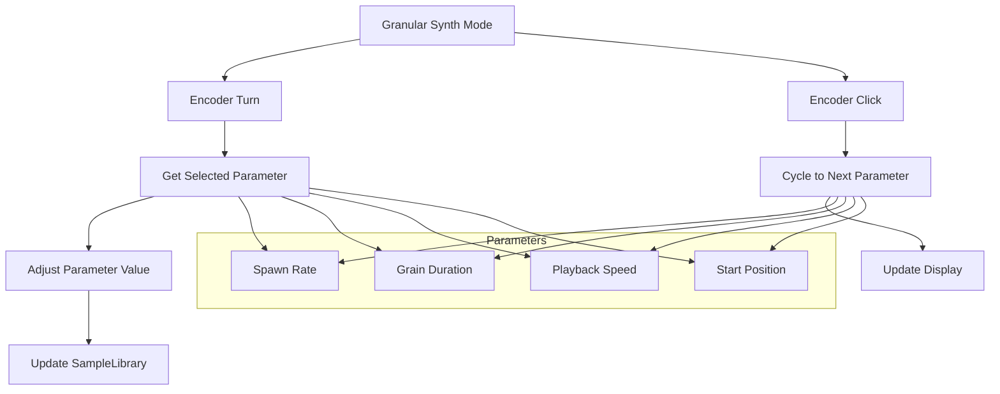

# Granular Synth Encoder Parameter Control

## Overview
This plan adds encoder-based parameter control to the granular synth mode. The encoder is used to select and adjust grain parameters.

## Requirements
1. **Encoder Turning**: Adjusts the value of the currently selected parameter
2. **Encoder Clicking**: Cycles through which parameter is being controlled
3. **Controllable Parameters**:
   - Spawn Rate (grains per second)
   - Grain Duration (seconds)
   - Playback Speed/Pitch multiplier
   - Start Position (0.0 to 1.0 within sample)

## Architecture



## Parameter Ranges and Defaults

| Parameter | Default | Min | Max | Step | Unit |
|-----------|---------|-----|-----|------|------|
| Spawn Rate | 30.0 | 1.0 | 100.0 | 1.0 | grains/sec |
| Grain Duration | 0.1 | 0.01 | 1.0 | 0.01 | seconds |
| Playback Speed | 1.0 | 0.1 | 4.0 | 0.1 | multiplier |
| Start Position | 0.5 | 0.0 | 1.0 | 0.01 | normalized |

## Display Layout

```
GRANULAR SYNTH
Sample: filename.wav
Gate: OPEN/CLOSED
Grains: X/8

Param: SpawnRate
Value: 30.0 g/s

B1:Gate B2:Next
Enc:Adj Click:Sel
Hold: Back
```

## Implementation Steps

### 1. Update SampleLibrary (SampleLibrary.h/cpp)
**Add granular parameter member variables:**
- `granularSpawnRate_` (float, default 30.0)
- `granularDuration_` (float, default 0.1)
- `granularSpeed_` (float, default 1.0)
- `granularPosition_` (float, default 0.5)

**Add getter/setter methods:**
- `setGranularSpawnRate(float rate)`
- `getGranularSpawnRate() const`
- `setGranularDuration(float duration)`
- `getGranularDuration() const`
- `setGranularSpeed(float speed)`
- `getGranularSpeed() const`
- `setGranularPosition(float position)`
- `getGranularPosition() const`

**Update processAudio() to use configurable parameters:**
- Replace hard-coded `spawnRate_` with `granularSpawnRate_`
- Replace hard-coded duration `0.1f` with `granularDuration_`
- Replace hard-coded speed `1.0f` with `granularSpeed_`
- Replace hard-coded position `0.5f` with `granularPosition_`

### 2. Update GranularSynthMenu (Menus.h/cpp)
**Add parameter selection enum:**
```cpp
enum class GranularParam {
    SPAWN_RATE,
    DURATION,
    SPEED,
    POSITION
};
```

**Add member variables:**
- `selectedParam_` (GranularParam, default SPAWN_RATE)
- `paramValues_` (array of 4 floats for current parameter values)

**Update render() to show:**
- Selected parameter name
- Current parameter value with appropriate unit

**Implement encoder handlers:**
- `onEncoderIncrement()`: Increase selected parameter value
- `onEncoderDecrement()`: Decrease selected parameter value
- `onEncoderClick()`: Cycle to next parameter

### 3. Update SimpleSampler main loop (SimpleSampler.cpp)
**Pass encoder changes to GranularSynthMenu:**
- When in granular mode, call `uiManager->handleEncoderIncrement()` on encoder turn
- When in granular mode, call `uiManager->handleEncoderClick()` on encoder click

**Note:** This may require modifying the existing encoder handling to conditionally pass to GranularSynthMenu.

### 4. Parameter Adjustment Logic

**Spawn Rate:** 1.0 to 100.0 grains/sec, step 1.0
**Grain Duration:** 0.01 to 1.0 seconds, step 0.01
**Playback Speed:** 0.1 to 4.0x, step 0.1
**Start Position:** 0.0 to 1.0, step 0.01

## File Changes Summary

| File | Changes |
|------|---------|
| SampleLibrary.h | Add granular parameter members, getter/setter methods |
| SampleLibrary.cpp | Initialize parameters, implement getters/setters, use parameters in spawnGrain() |
| Menus.h | Add GranularParam enum to GranularSynthMenu |
| Menus.cpp | Implement parameter selection and adjustment in GranularSynthMenu |
| SimpleSampler.cpp | Ensure encoder is passed to GranularSynthMenu in granular mode |

## Notes
- Parameter values should be clamped to valid ranges
- Display should show appropriate units for each parameter
- Encoder click cycles through parameters in order: Spawn Rate → Duration → Speed → Position → (back to Spawn Rate)
