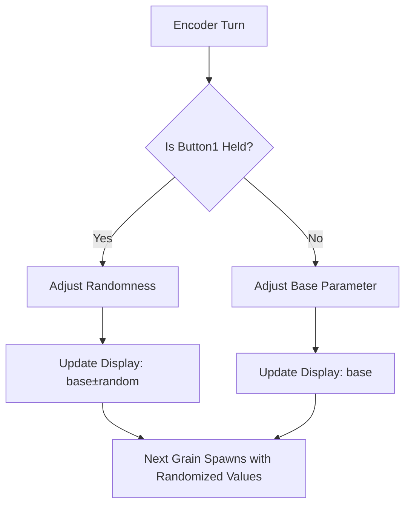

# Granular Randomness Implementation Plan

## Overview
Add randomness parameters to the granular synth, allowing per-grain variation. When the gate button (Button1) is held, the encoder adjusts randomness; when not held, the encoder adjusts the base parameter.

## Requirements
1. Add randomness for all 4 granular parameters: Spawn Rate, Duration, Speed, Position
2. Randomness is additive: `final_value = base_value ± random_amount`
3. Each grain is randomized individually
4. UI displays base value with randomness (e.g., `Rate:30±10`)
5. Button1 (gate) acts as modifier: hold to adjust randomness, release to adjust base

## Encoder Behavior Flow



## Implementation Steps

### 1. Add Randomness Constants (Constants.h)
Add step sizes for randomness adjustment:
- `SPAWN_RATE_RANDOM_STEP`: 1 grain/sec
- `DURATION_RANDOM_STEP`: 0.01 seconds
- `SPEED_RANDOM_STEP`: 0.1x
- `POSITION_RANDOM_STEP`: 0.01

### 2. Add Randomness Member Variables (SampleLibrary.h)
Add 4 new private member variables:
```cpp
float granularSpawnRateRandom_;    // Spawn rate randomness (0-50 grains/sec)
float granularDurationRandom_;     // Duration randomness (0-0.5 seconds)
float granularSpeedRandom_;        // Speed randomness (0-2.0x)
float granularPositionRandom_;     // Position randomness (0-0.5)
```

### 3. Add Randomness Getter/Setter Methods (SampleLibrary.h)
Add 8 new public methods:
```cpp
// Spawn rate randomness
void setGranularSpawnRateRandom(float random);
float getGranularSpawnRateRandom() const;

// Duration randomness
void setGranularDurationRandom(float random);
float getGranularDurationRandom() const;

// Speed randomness
void setGranularSpeedRandom(float random);
float getGranularSpeedRandom() const;

// Position randomness
void setGranularPositionRandom(float random);
float getGranularPositionRandom() const;
```

### 4. Initialize Randomness Values (SampleLibrary.cpp constructor)
Initialize all randomness to 0 (no randomness by default):
```cpp
granularSpawnRateRandom_ = 0.0f;
granularDurationRandom_ = 0.0f;
granularSpeedRandom_ = 0.0f;
granularPositionRandom_ = 0.0f;
```

### 5. Implement Randomness Setters (SampleLibrary.cpp)
Each setter clamps the value to an appropriate range:
- Spawn Rate: 0 to 50 grains/sec
- Duration: 0 to 0.5 seconds
- Speed: 0 to 2.0x
- Position: 0 to 0.5

### 6. Modify spawnGrain() to Apply Randomness (SampleLibrary.cpp)
When spawning a grain, apply random variation to each parameter:
```cpp
// Use daisysp::GetRandomFloat() for random values
float randomOffset = GetRandomFloat(-1.0f, 1.0f) * randomnessAmount;
float finalValue = baseValue + randomOffset;
// Clamp to valid parameter range
```

### 7. Update GranularSynthMenu Display (Menus.cpp)
Modify `render()` to show base ± randomness:
```cpp
// Display format: "Rate:30±10" or "Rate:30" if randomness is 0
char valueStr[32];
if (randomness > 0.001f) {
    formatFloatToString(randomness, decimalPlaces, randomStr, sizeof(randomStr));
    snprintf(valueStr, sizeof(valueStr), "%s±%s", baseStr, randomStr);
} else {
    snprintf(valueStr, sizeof(valueStr), "%s", baseStr);
}
```

### 8. Modify GranularSynthMenu Encoder Handlers (Menus.cpp)
Update `onEncoderIncrement()` and `onEncoderDecrement()`:
```cpp
bool gateOpen = sampleLibrary_->isGateOpen();
if (gateOpen) {
    // Adjust randomness of selected parameter
    // Use randomness step sizes
} else {
    // Adjust base parameter (existing behavior)
}
```

### 9. Update UI Footer (Menus.cpp)
Add hint about randomness mode:
- Normal: `B1:Gate B2:Next*`
- When randomness > 0: `B1:Gate+Rnd B2:Next*`

## File Changes Summary

| File | Changes |
|------|---------|
| `Constants.h` | Add randomness step size constants |
| `SampleLibrary.h` | Add randomness member variables and getter/setter methods |
| `SampleLibrary.cpp` | Initialize randomness, implement setters, modify spawnGrain() |
| `Menus.cpp` | Update display format, modify encoder handlers |

## Testing
After implementation, test with:
```bash
make clean && make && make program
```

Verify:
1. Base parameter adjustment works without holding Button1
2. Randomness adjustment works while holding Button1
3. Display shows correct format (base±random or just base)
4. Each grain spawns with randomized values when randomness > 0
5. Randomness values are properly clamped to valid ranges
