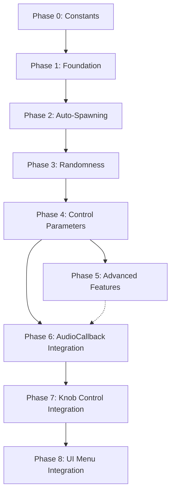

# Granular Synthesis Implementation Plan for SimpleSampler

This document provides an overview of the granular synthesis implementation plan. Each phase is detailed in its own file.

> **NOTE:** This plan has been updated based on current codebase review. Key changes include:
> - Reduced MAX_GRAINS to 8 for embedded system memory safety
> - Added AudioCallback, knob, and UI integration phases
> - Fixed grain lifecycle management
> - Leveraged b3WavTicker's built-in envelope methods
> - Removed redundant spawnInterval_ parameter (using spawnRate_ instead)

---

## Table of Contents

1. [Overview](#overview)
2. [Phase 0: Constants](#phase-0-constants)
3. [Phase 1: Foundation](#phase-1-foundation)
4. [Phase 2: Auto-Spawning](#phase-2-auto-spawning)
5. [Phase 3: Randomness](#phase-3-randomness)
6. [Phase 4: Control Parameters](#phase-4-control-parameters)
7. [Phase 5: Advanced Features](#phase-5-advanced-features)
8. [Phase 6: AudioCallback Integration](#phase-6-audiocallback-integration)
9. [Phase 7: Knob Control Integration](#phase-7-knob-control-integration)
10. [Phase 8: UI Menu Integration](#phase-8-ui-menu-integration)

---

## Overview

### What is Granular Synthesis?

Granular synthesis breaks audio into tiny fragments called "grains" (typically 1-50 milliseconds), then recombines them to create new sounds. Each grain is a short snippet of audio that's shaped by an envelope to prevent clicks.

### Key Concepts

| Concept | Description | Typical Values |
|----------|-------------|----------------|
| **Grain Size** | Duration of each grain | 1-50ms |
| **Grain Density** | How many grains per second | 10-200 grains/sec |
| **Position** | Where in source audio to read from | 0 to buffer length |
| **Pitch** | Playback speed of each grain | 0.5x to 2.0x (±1 octave) |
| **Envelope** | Shape of grain (fade in/out) | Gaussian, Hanning, etc. |

### Comparison: SimpleSampler vs Granular

**SimpleSampler (Current):**
- One ticker per sample file
- Plays from START → END
- One continuous playback per sample

**Granular Synthesis (New):**
- Multiple grains (tickers) referencing the SAME WAV file
- Each grain starts at a RANDOM position
- Each grain has its own duration and pitch
- Multiple grains play simultaneously

---

## Phase 0: Constants

**File:** [`plans/granular-phase0-constants.md`](granular-phase0-constants.md)

**Goal:** Add granular-specific constants to the project configuration.

**Summary:**
- Add `MAX_GRAINS = 8` to `Constants.h` (reduced for embedded safety)
- 8 grains provides sufficient granular density while minimizing memory impact

---

## Phase 1: Foundation

**File:** [`plans/granular-phase1-foundation.md`](granular-phase1-foundation.md)

**Goal:** Create the basic data structures and functions to spawn and play multiple grains from a single sample.

**Summary:**
- Add `Grain` struct to hold grain state
- Add grain pool and granular mode state to `SampleLibrary` class
- Initialize grain pool in constructor
- Add `spawnGrain()` method declaration and implementation
- Add `setGranularMode()` and `setGranularSampleIndex()` methods
- Update `processAudio()` to handle grains with proper lifecycle management
- Test basic grain spawning

---

## Phase 2: Auto-Spawning

**File:** [`plans/granular-phase2-autospawning.md`](granular-phase2-autospawning.md)

**Goal:** Automatically spawn grains at regular intervals to create continuous granular texture.

**Summary:**
- Implement auto-spawning logic in `processAudio()`
- Only spawn when `granularModeEnabled_` is true
- Use `spawnRate_` (grains per second) instead of `spawnInterval_`
- Add `setSpawnRate()` method
- Use `granularSampleIndex_` for sample selection

---

## Phase 3: Randomness

**File:** [`plans/granular-phase3-randomness.md`](granular-phase3-randomness.md)

**Goal:** Add random variation to grain parameters for more organic, less mechanical sound.

**Summary:**
- Add randomness parameters (position, duration, pitch)
- Initialize randomness in constructor
- Update `spawnGrain()` to apply randomness
- Add setter methods for randomness control

---

## Phase 4: Control Parameters

**File:** [`plans/granular-phase4-control-parameters.md`](granular-phase4-control-parameters.md)

**Goal:** Map knobs/controls to granular parameters for real-time manipulation.

**Summary:**
- Add control parameter variables (grainPosition, grainDuration, spawnRate, grainPitch)
- Initialize control parameters in constructor
- Update auto-spawning to use controlled parameters
- Add getter/setter methods for all control parameters

---

## Phase 5: Advanced Features

**File:** [`plans/granular-phase5-advanced-features.md`](granular-phase5-advanced-features.md)

**Goal:** Add advanced features like envelope control, freeze mode, and presets.

**Summary:**
- Add envelope shape selection (use b3WavTicker's built-in methods)
- Add freeze mode for infinite sustain
- Add preset system for saving/loading parameter configurations
- Add multi-sample granular mode (optional)

---

## Phase 6: AudioCallback Integration

**File:** [`plans/granular-phase6-audiocallback-integration.md`](granular-phase6-audiocallback-integration.md)

**Goal:** Integrate granular audio processing into the existing AudioCallback.

**Summary:**
- Update `AudioCallback` in `SimpleSampler.cpp` to handle `MODE_GRANULAR`
- Call `sampleLibrary.processAudio()` when in granular mode
- Ensure proper audio routing and mixing

---

## Phase 7: Knob Control Integration

**File:** [`plans/granular-phase7-knob-integration.md`](granular-phase7-knob-integration.md)

**Goal:** Map Daisy Pod knobs to granular parameters for real-time control.

**Summary:**
- Add granular mode knob handling in main loop
- Map Knob 1 to grain position
- Map Knob 2 to position randomness
- Map Knob 3 to spawn rate (or use encoder)
- Add LED feedback for granular mode

---

## Phase 8: UI Menu Integration

**File:** [`plans/granular-phase8-ui-menu-integration.md`](granular-phase8-ui-menu-integration.md)

**Goal:** Create UI menus for granular parameter control.

**Summary:**
- Create `GranularMenu` class inheriting from `BaseMenu`
- Add granular parameter screens to menu system
- Implement encoder/button handling for granular parameters
- Update `UIManager` to include granular menu

---

## Tips and Best Practices

### Performance
- Limit `MAX_GRAINS` to 8 for embedded safety (can increase later if needed)
- Use envelope to prevent clicks at grain boundaries
- Scale volume by `1.0 / activeGrainCount_` to prevent clipping

### Sound Design
- Start with small `grainDuration` (10-50ms) for texture
- Use `spawnRate` of 20-50 grains/sec for dense textures
- Add randomness gradually (start with 0, increase slowly)
- Use `freezeMode` for ambient pads and drones

### Debugging
- Monitor `activeGrainCount_` to see how many grains are playing
- Test with single grain first, then increase density
- Use display to show current granular parameters

---

## Next Steps

- [ ] **Implement Phase 0** to add constants
- [ ] **Implement Phase 1** to verify basic grain playback works
- [ ] **Add Phase 2** for continuous granular texture
- [ ] **Experiment with Phase 3** randomness values
- [ ] **Map controls in Phase 4** for real-time manipulation
- [ ] **Integrate AudioCallback in Phase 6** to enable granular mode
- [ ] **Add knob control in Phase 7** for real-time parameter tweaking
- [ ] **Create UI menus in Phase 8** for visual parameter control
- [ ] **Add Phase 5** features as needed for your sound design goals

---

## Implementation Order

