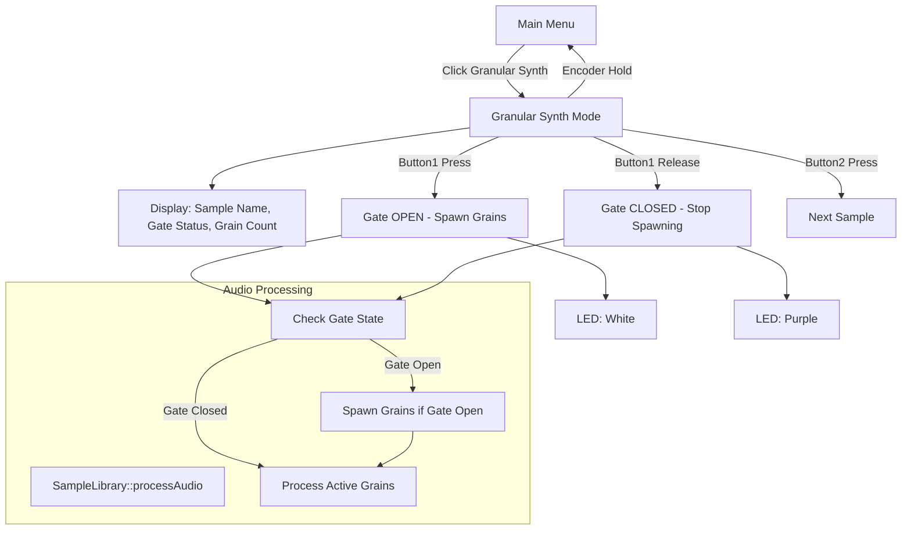

# Granular Synth Mode Updates

## Overview
This plan implements the granular synth mode with gate-based grain spawning and sample cycling.

## Requirements
1. **Menu Entry**: Clicking "Granular Synth" in main menu enters granular synth mode
2. **Button1 (Gate)**: Hold to spawn grains continuously at the hard-coded spawn rate (30 grains/second)
3. **Button2 (Sample Cycle)**: Cycle through all loaded samples
4. **Display**: Show current sample name, gate status (OPEN/CLOSED), and active grain count
5. **LED Feedback**: Show gate state (white when open, purple when closed)

## Architecture



## Implementation Steps

### 1. Update SampleLibrary (SampleLibrary.h/cpp)
**Changes needed:**
- Add `gateOpen_` boolean member variable
- Add `setGateOpen(bool open)` method
- Add `isGateOpen()` const method
- Modify `processAudio()` to only spawn grains when `gateOpen_` is true

### 2. Create GranularSynthMenu Class (Menus.h/cpp)
**New class to replace GranularPlaceholder:**

```cpp
class GranularSynthMenu : public BaseMenu {
private:
    int granularSampleIndex_;  // Currently selected sample for granular

public:
    GranularSynthMenu(DisplayManager* display, Sequencer* sequencer,
                      SampleLibrary* sampleLibrary, UIState* state, UIManager* uiManager);

    void render() override;
    void onButton1Press() override;   // Set gate open
    void onButton2Press() override;   // Cycle to next sample
    void onEncoderHold() override;    // Return to main menu
};
```

**Display Layout:**
```
GRANULAR SYNTH
Sample: filename.wav
Gate: OPEN/CLOSED
Grains: X/8
Hold: Back
```

### 3. Update UIManager (UIManager.h/cpp)
**Changes needed:**
- Add `SCREEN_GRANULAR_SYNTH` to `ScreenType` enum
- Replace `GranularPlaceholder` with `GranularSynthMenu` in `createMenus()`
- Update `MainMenu::onEncoderClick()` to use `SCREEN_GRANULAR_SYNTH`

### 4. Update SimpleSampler Main Loop (SimpleSampler.cpp)
**Changes needed:**
- Track Button1 press/release state using `RisingEdge()` and `FallingEdge()`
- Call `library->setGateOpen(true/false)` based on button state
- Update LED colors:
  - Gate open: `hw.led1.Set(1.0f, 1.0f, 1.0f)` (white)
  - Gate closed: `hw.led1.Set(0.5f, 0.0f, 0.5f)` (purple)

## File Changes Summary

| File | Changes |
|------|---------|
| SampleLibrary.h | Add gateOpen_, setGateOpen(), isGateOpen() |
| SampleLibrary.cpp | Modify processAudio() for gate-based spawning |
| Menus.h | Add GranularSynthMenu class declaration |
| Menus.cpp | Implement GranularSynthMenu, update MainMenu |
| UIManager.h | Add SCREEN_GRANULAR_SYNTH enum |
| UIManager.cpp | Update createMenus() to use GranularSynthMenu |
| SimpleSampler.cpp | Add Button1 gate tracking, LED updates |

## Notes
- The hard-coded spawn rate (30 grains/second) is defined in `SampleLibrary` constructor
- Grain parameters (startPosition=0.5, duration=0.1s, speed=1.0) remain hard-coded for now
- Maximum grains is set to 8 in `Constants.h` for embedded safety
