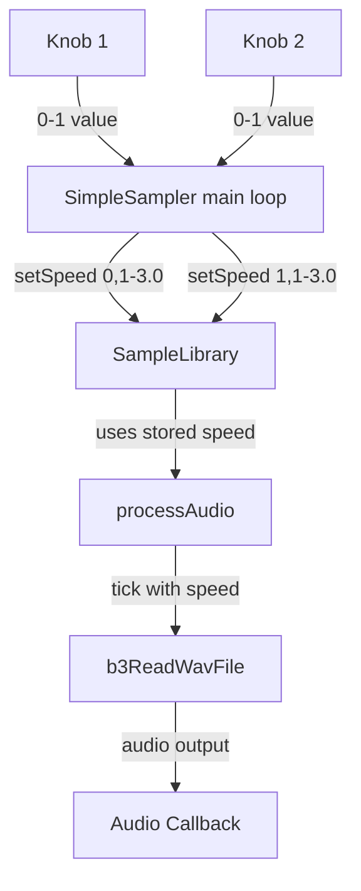

# Knob-Controlled Sample Speed Implementation Plan

## Overview
Modify the SimpleSampler to make Knob 1 control the playback speed of Sample 0 and Knob 2 control the playback speed of Sample 1.

## Requirements
- **Knob 1** → Sample 0 speed
- **Knob 2** → Sample 1 speed
- **Speed Range**: 0.1x to 3.0x
- **Control Type**: Real-time (speed changes while sample is playing)

## Architecture Changes

### Data Flow


## Implementation Steps

### Step 1: Modify SampleLibrary.h
Add speed storage array and a public setter method.

**Changes:**
- Add `float sampleSpeeds_[MAX_SAMPLES]` private member to store per-sample speeds
- Initialize speeds to 1.0 (normal speed) in constructor
- Add `void setSampleSpeed(int index, float speed)` public method

### Step 2: Modify SampleLibrary.cpp
Implement speed storage and use it in `processAudio()`.

**Changes:**
- Initialize `sampleSpeeds_` array to 1.0 in constructor
- Implement `setSampleSpeed()` method with bounds checking
- Modify `processAudio()` to use `sampleSpeeds_[i]` instead of hardcoded 1.0

### Step 3: Modify SimpleSampler.cpp
Read knob values and pass to SampleLibrary.

**Changes:**
- Change knob initialization from `0-1` to appropriate range mapping
- In main loop, read knob values and map from 0-1 to 0.1-3.0
- Call `library->setSampleSpeed(0, knob1_value)` and `library->setSampleSpeed(1, knob2_value)`
- Remove or repurpose the LED color code that currently uses knob values

## Code Modifications Summary

### SampleLibrary.h
```cpp
// Add to private section:
float sampleSpeeds_[MAX_SAMPLES];  // Per-sample playback speed

// Add to public section:
void setSampleSpeed(int index, float speed);  // Set playback speed for a sample
```

### SampleLibrary.cpp
```cpp
// In constructor:
for (int i = 0; i < MAX_SAMPLES; i++) {
    sampleSpeeds_[i] = 1.0f;  // Default to normal speed
}

// New method:
void SampleLibrary::setSampleSpeed(int index, float speed) {
    if (index >= 0 && index < MAX_SAMPLES) {
        sampleSpeeds_[index] = speed;
    }
}

// In processAudio():
// Replace: 1.0,  // speed
// With: sampleSpeeds_[i],  // speed
```

### SimpleSampler.cpp
```cpp
// In main loop:
float knob1_value = p_knob1.Process();
float knob2_value = p_knob2.Process();

// Map 0-1 to 0.1-3.0
float speed0 = 0.1f + (knob1_value * 2.9f);  // 0.1 to 3.0
float speed1 = 0.1f + (knob2_value * 2.9f);  // 0.1 to 3.0

// Update sample speeds
library->setSampleSpeed(0, speed0);
library->setSampleSpeed(1, speed1);
```

## Testing Checklist
- [ ] Knob 1 at minimum position plays Sample 0 at 0.1x speed
- [ ] Knob 1 at center position plays Sample 0 at ~1.55x speed
- [ ] Knob 1 at maximum position plays Sample 0 at 3.0x speed
- [ ] Knob 2 at minimum position plays Sample 1 at 0.1x speed
- [ ] Knob 2 at center position plays Sample 1 at ~1.55x speed
- [ ] Knob 2 at maximum position plays Sample 1 at 3.0x speed
- [ ] Speed changes in real-time while sample is playing
- [ ] Both samples can play simultaneously with independent speeds
