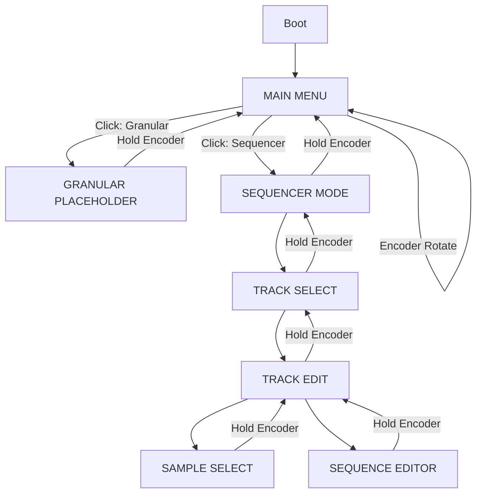

# Main Menu Implementation Plan

## Overview
Implement a main menu system that boots first on the Daisy, allowing users to select between the Granular Synthesizer (placeholder) and the Step Sequencer (existing implementation).

## Current Architecture
The Daisy currently boots directly into the Step Sequencer mode with:
- `SimpleSampler.cpp` initializes and auto-starts the sequencer
- `UIManager` manages 4 screens: Track Select, Track Edit, Sample Select, Sequence Editor
- No mode switching mechanism exists

## Proposed Architecture

### Mode System
A new `AppMode` enum will track the current application state:

```cpp
enum class AppMode {
    MAIN_MENU,         // Main menu for mode selection
    GRANULAR,          // Granular synthesizer (placeholder)
    SEQUENCER          // Step sequencer (existing)
};
```

### Screen Types
New screen types to be added to `ScreenType` enum:
- `SCREEN_MAIN_MENU` - Main menu with Granular/Sequencer options
- `SCREEN_GRANULAR_PLACEHOLDER` - Placeholder screen for granular synth

### Navigation Flow



## Implementation Steps

### 1. Update UIManager.h
- Add `SCREEN_MAIN_MENU` and `SCREEN_GRANULAR_PLACEHOLDER` to `ScreenType` enum
- Add `AppMode` enum and `currentMode` field to `UIState`
- Update `NUM_SCREENS` constant from 4 to 6

### 2. Create MainMenu Class (Menus.h/cpp)
```cpp
class MainMenu : public BaseMenu {
private:
    enum class Option { GRANULAR, SEQUENCER };
    Option selectedOption_;
public:
    MainMenu(DisplayManager*, Sequencer*, SampleLibrary*, UIState*, UIManager*);
    void render() override;
    void onEncoderIncrement() override;
    void onEncoderDecrement() override;
    void onEncoderClick() override;
};
```

### 3. Create GranularPlaceholder Class (Menus.h/cpp)
```cpp
class GranularPlaceholder : public BaseMenu {
public:
    GranularPlaceholder(DisplayManager*, Sequencer*, SampleLibrary*, UIState*, UIManager*);
    void render() override;
    void onEncoderIncrement() override;
    void onEncoderDecrement() override;
    void onEncoderHold() override;  // Return to main menu
};
```

### 4. Update UIManager
- Modify `createMenus()` to instantiate new menu classes
- Add `setAppMode()` method to switch between modes
- Update `handleEncoderHold()` to return to main menu when in sequencer/granular modes

### 5. Update SimpleSampler.cpp
- **main()**: Remove `sequencer->setRunning(true)` - sequencer starts stopped
- **main()**: Set initial screen to `SCREEN_MAIN_MENU`
- **AudioCallback**: Add mode check - only process sequencer audio when in `SEQUENCER` mode
- **main loop**: Handle knob inputs based on current mode (BPM/Metronome only in Sequencer mode)

### 6. Add Return-to-Menu Functionality
- Modify existing menus' `onEncoderHold()` to navigate up the hierarchy
- Top-level menus in each mode return to main menu on hold

## Key Design Decisions

1. **Mode vs Screen Distinction**
   - `AppMode` tracks high-level application state (Main/Granular/Sequencer)
   - `ScreenType` tracks specific UI screen within a mode
   - This separation allows clean mode switching and audio routing

2. **Audio Handling**
   - Sequencer audio only processed when in `SEQUENCER` mode
   - Granular mode will have its own audio processing (placeholder = silence)
   - Main menu mode = no audio processing

3. **Navigation Hierarchy**
   - Encoder hold always goes "up" one level
   - At top of mode hierarchy, hold returns to main menu

4. **Knob Behavior**
   - In Main Menu: Knobs have no function (or could be used for visual feedback)
   - In Sequencer Mode: Existing behavior (Knob 1 = BPM, Knob 2 = Metronome volume)
   - In Granular Mode: Placeholder (no function)

## Files to Modify

1. `UIManager.h` - Add new screen types and AppMode enum
2. `UIManager.cpp` - Update menu creation and mode switching
3. `Menus.h` - Add MainMenu and GranularPlaceholder class declarations
4. `Menus.cpp` - Implement MainMenu and GranularPlaceholder classes
5. `SimpleSampler.cpp` - Update boot behavior and audio handling
6. `Constants.h` - May need new constants for UI/mode handling

## Testing Checklist

- [ ] Daisy boots into main menu (not sequencer)
- [ ] Encoder rotates between Granular and Sequencer options
- [ ] Click enters selected mode
- [ ] Granular placeholder displays correctly
- [ ] Sequencer mode works as before
- [ ] Hold encoder returns to main menu from any mode
- [ ] Sequencer audio only plays when in Sequencer mode
- [ ] Knobs only function in Sequencer mode
