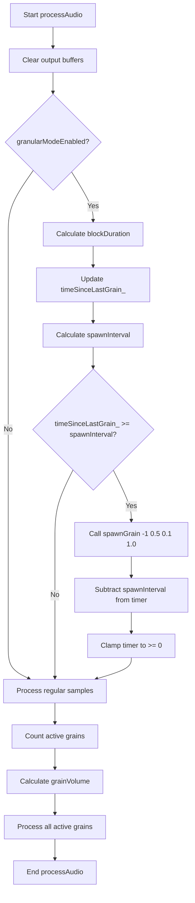

# Phase 2.1: Auto-Spawning Implementation Design

## Overview

This document provides the detailed design for implementing auto-spawning logic in [`SampleLibrary::processAudio()`](SampleLibrary.cpp:191). This is Step 2.1 of the granular synthesis implementation.

## Current State Analysis

### Existing Code Structure (Phase 1 Complete)

**Member Variables in SampleLibrary.h (lines 44-52):**
```cpp
// Granular synthesis state
Grain grains_[Constants::SampleLibrary::MAX_GRAINS];  // Pool of grain objects
int activeGrainCount_;                                 // Number of currently active grains
bool granularModeEnabled_;                              // Is granular synthesis active?
int granularSampleIndex_;                                // Which sample to use for granular

// Spawning timer (auto-spawning)
float timeSinceLastGrain_;  // Time elapsed since last grain spawned
float spawnRate_;           // Grains per second
```

**Grain Struct in SampleLibrary.h (lines 29-33):**
```cpp
struct Grain {
    b3WavTicker ticker;          // Playback position tracker
    int sampleIndex;              // Which sample file this grain uses
    float envelopePhase;          // Progress through grain (0.0 to 1.0)
};
```

**Important Note:** The actual `Grain` struct differs from Phase 1 plan:
- No `finished` field - use `grains_[i].ticker.finished_`
- No `speed` field - use `grains_[i].ticker.speed_`
- No `startTime`, `endTime` fields - these are in the ticker

**Existing processAudio() in SampleLibrary.cpp (lines 191-241):**
```cpp
void SampleLibrary::processAudio(float** out, size_t size) {
    // Clear output buffers to zero
    for (size_t i = 0; i < size; i++) {
        out[0][i] = 0.0f;
        out[1][i] = 0.0f;
    }
    
    // Process regular sample playback (existing functionality)
    for (int i = 0; i < sampleCount_; i++) {
        if (!wavTickers_[i].finished_) {
            samples_[i].reader.tick(
                &wavTickers_[i],
                samples_[i].dataSource,
                sampleSpeeds_[i],
                1.0,
                size,
                out[0],
                out[1]
            );
        }
    }
    
    // First pass: count active grains
    activeGrainCount_ = 0;
    for (int i = 0; i < Constants::SampleLibrary::MAX_GRAINS; i++) {
        if (!grains_[i].ticker.finished_) {
            activeGrainCount_++;
        }
    }
    
    // Calculate uniform volume for all grains
    float grainVolume = (activeGrainCount_ > 0) ? (1.0f / activeGrainCount_) : 0.0f;
    
    // Second pass: process all active grains
    for (int i = 0; i < Constants::SampleLibrary::MAX_GRAINS; i++) {
        if (!grains_[i].ticker.finished_) {
            int sampleIndex = grains_[i].sampleIndex;
            double speed = grains_[i].ticker.speed_;
            
            samples_[sampleIndex].reader.tick(
                &grains_[i].ticker,
                samples_[sampleIndex].dataSource,
                speed,
                grainVolume,
                size,
                out[0],
                out[1]
            );
        }
    }
}
```

## Auto-Spawning Logic Design

### Location of Changes

The auto-spawning logic must be inserted **after clearing output buffers** and **before processing regular samples**. This ensures:
1. Output is clean before any audio generation
2. Auto-spawned grains are processed in the same pass as existing grains
3. Regular sample playback continues to work normally

### Code Changes Required

**Insert after line 196 (after clearing output buffers, before regular sample processing):**

```cpp
    // Auto-spawning: Only spawn if granular mode is enabled
    if (granularModeEnabled_) {
        // Calculate the duration of this audio block in seconds
        float blockDuration = (float)size / Config::samplerate;
        
        // Update the time elapsed since last grain spawn
        timeSinceLastGrain_ += blockDuration;
        
        // Calculate spawn interval from spawn rate (grains per second)
        float spawnInterval = 1.0f / spawnRate_;
        
        // Check if it's time to spawn a new grain
        if (timeSinceLastGrain_ >= spawnInterval) {
            // Spawn grain using granularSampleIndex_ (sampleIndex -1)
            // Parameters: sampleIndex=-1, startPosition=0.5, duration=0.1s, speed=1.0
            spawnGrain(-1, 0.5f, 0.1f, 1.0f);
            
            // Reset timer (subtract interval to handle multiple spawns per block)
            timeSinceLastGrain_ -= spawnInterval;
            
            // Clamp to 0 to prevent negative values
            if (timeSinceLastGrain_ < 0.0f) {
                timeSinceLastGrain_ = 0.0f;
            }
        }
    }
```

### Complete Modified processAudio()

```cpp
void SampleLibrary::processAudio(float** out, size_t size) {
    // Clear output buffers to zero
    for (size_t i = 0; i < size; i++) {
        out[0][i] = 0.0f;
        out[1][i] = 0.0f;
    }
    
    // ========== AUTO-SPAWNING LOGIC (NEW) ==========
    // Auto-spawning: Only spawn if granular mode is enabled
    if (granularModeEnabled_) {
        // Calculate the duration of this audio block in seconds
        float blockDuration = (float)size / Config::samplerate;
        
        // Update the time elapsed since last grain spawn
        timeSinceLastGrain_ += blockDuration;
        
        // Calculate spawn interval from spawn rate (grains per second)
        float spawnInterval = 1.0f / spawnRate_;
        
        // Check if it's time to spawn a new grain
        if (timeSinceLastGrain_ >= spawnInterval) {
            // Spawn grain using granularSampleIndex_ (sampleIndex -1)
            // Parameters: sampleIndex=-1, startPosition=0.5, duration=0.1s, speed=1.0
            spawnGrain(-1, 0.5f, 0.1f, 1.0f);
            
            // Reset timer (subtract interval to handle multiple spawns per block)
            timeSinceLastGrain_ -= spawnInterval;
            
            // Clamp to 0 to prevent negative values
            if (timeSinceLastGrain_ < 0.0f) {
                timeSinceLastGrain_ = 0.0f;
            }
        }
    }
    // ========== END AUTO-SPAWNING LOGIC ==========
    
    // Process regular sample playback (existing functionality)
    for (int i = 0; i < sampleCount_; i++) {
        if (!wavTickers_[i].finished_) {
            samples_[i].reader.tick(
                &wavTickers_[i],
                samples_[i].dataSource,
                sampleSpeeds_[i],
                1.0,
                size,
                out[0],
                out[1]
            );
        }
    }
    
    // First pass: count active grains
    activeGrainCount_ = 0;
    for (int i = 0; i < Constants::SampleLibrary::MAX_GRAINS; i++) {
        if (!grains_[i].ticker.finished_) {
            activeGrainCount_++;
        }
    }
    
    // Calculate uniform volume for all grains
    float grainVolume = (activeGrainCount_ > 0) ? (1.0f / activeGrainCount_) : 0.0f;
    
    // Second pass: process all active grains
    for (int i = 0; i < Constants::SampleLibrary::MAX_GRAINS; i++) {
        if (!grains_[i].ticker.finished_) {
            int sampleIndex = grains_[i].sampleIndex;
            double speed = grains_[i].ticker.speed_;
            
            samples_[sampleIndex].reader.tick(
                &grains_[i].ticker,
                samples_[sampleIndex].dataSource,
                speed,
                grainVolume,
                size,
                out[0],
                out[1]
            );
        }
    }
}
```

## Flow Diagram



## Key Design Decisions

### 1. Placement of Auto-Spawning Logic
- **Chosen:** After clearing buffers, before regular sample processing
- **Rationale:** Ensures clean state before any audio generation, and auto-spawned grains are processed in the same pass as existing grains

### 2. Timer Reset Strategy
- **Chosen:** Subtract interval instead of setting to 0
- **Rationale:** Handles cases where multiple grains should spawn in a single audio block (e.g., high spawn rates)
- **Example:** If `spawnRate_ = 100` grains/sec and `blockDuration = 0.01s`, the interval is 0.01s. If `timeSinceLastGrain_ = 0.02s`, we need to spawn 2 grains. Subtracting the interval allows the loop to continue checking.

### 3. Grain Parameters
- **sampleIndex:** `-1` (uses `granularSampleIndex_`)
- **startPosition:** `0.5f` (middle of sample)
- **duration:** `0.1f` (100 milliseconds)
- **speed:** `1.0f` (normal pitch)
- **Rationale:** These are placeholder values that will be parameterized in Phase 4

### 4. Data Type Consistency
- **Chosen:** Use `float` for time values (matching existing `timeSinceLastGrain_` and `spawnRate_`)
- **Rationale:** Consistency with existing code, sufficient precision for audio timing

## Edge Cases and Considerations

### 1. No Available Grain Slots
- **Scenario:** All `MAX_GRAINS` slots are active
- **Behavior:** `spawnGrain()` returns `false`, no grain is spawned
- **Impact:** Auto-spawning continues, but no new grains appear until one finishes
- **Mitigation:** This is acceptable behavior; the grain pool acts as a natural limiter

### 2. Invalid granularSampleIndex_
- **Scenario:** `granularSampleIndex_` is out of bounds or sample not loaded
- **Behavior:** `spawnGrain()` returns `false`, no grain is spawned
- **Impact:** Auto-spawning continues attempting but fails silently
- **Mitigation:** This should be validated when setting the index (already done in `setGranularSampleIndex()`)

### 3. High Spawn Rates
- **Scenario:** `spawnRate_` is very high (e.g., 100 grains/sec)
- **Behavior:** Multiple grains may spawn in a single audio block
- **Impact:** May exceed `MAX_GRAINS` quickly
- **Mitigation:** Grain pool naturally limits; spawn rate will be capped in Phase 4

### 4. Very Low Spawn Rates
- **Scenario:** `spawnRate_` is very low (e.g., 1 grain/sec)
- **Behavior:** Long gaps between grains
- **Impact:** Sparse texture
- **Mitigation:** This is expected behavior

### 5. Mode Toggle While Timer is Running
- **Scenario:** `granularModeEnabled_` is toggled mid-stream
- **Behavior:** Timer is not reset when mode is disabled
- **Impact:** When re-enabled, timer continues from previous value
- **Mitigation:** This is acceptable; no need to reset timer

### 6. Sample Rate Changes
- **Scenario:** `Config::samplerate` changes (unlikely in embedded system)
- **Behavior:** `blockDuration` calculation uses current samplerate
- **Impact:** Timing adapts to new samplerate
- **Mitigation:** Daisy typically has fixed samplerate, so this is not a concern

### 7. Zero or Negative spawnRate_
- **Scenario:** `spawnRate_` is 0 or negative
- **Behavior:** Division by zero or negative interval
- **Impact:** Undefined behavior
- **Mitigation:** `spawnRate_` should be clamped to positive range (will be added in Phase 2.2)

## Performance Considerations

### Embedded System Constraints
- **Daisy Seed:** ARM Cortex-M7, 480 MHz
- **Audio Block Size:** Typically 48-128 samples at 48 kHz
- **Memory:** Limited RAM, but SDRAM available for samples

### Computational Cost
- **Timer Update:** 2 float operations per audio block
- **Spawn Check:** 1 float comparison per audio block
- **spawnGrain() Call:** Only when timer triggers (not every block)
- **Overall Impact:** Minimal - adds negligible overhead to existing processing

### Memory Impact
- **No additional memory required:** All member variables already exist from Phase 1
- **No new allocations:** Grain pool is pre-allocated

## Integration with Existing Code

### No Changes Required To:
- `SampleLibrary.h` - All member variables and methods already exist
- `spawnGrain()` - Already implemented and working correctly
- Grain processing loop - Already handles active grains correctly

### Only Change Required:
- `processAudio()` in `SampleLibrary.cpp` - Insert auto-spawning logic

## Success Criteria

After implementation:
1. When `granularModeEnabled_` is true, grains spawn automatically at regular intervals
2. The spawn interval equals `1.0 / spawnRate_` seconds
3. No grains spawn when `granularModeEnabled_` is false
4. Regular sample playback continues to work normally
5. `activeGrainCount_` fluctuates as grains spawn and finish
6. No audio artifacts (clicks, pops) from auto-spawning
7. Timer correctly handles multiple spawns per block when spawn rate is high

## Testing Recommendations

1. **Basic Functionality:**
   - Enable granular mode
   - Verify continuous stream of grains
   - Check that `activeGrainCount_` varies appropriately

2. **Mode Toggle:**
   - Toggle granular mode on/off
   - Verify spawning stops when disabled
   - Verify spawning resumes when re-enabled

3. **Spawn Rate Variation:**
   - Vary `spawnRate_` from low to high
   - Verify density changes accordingly

4. **Grain Pool Limit:**
   - Set high spawn rate
   - Verify no more than `MAX_GRAINS` active
   - Verify new grains appear as old ones finish

5. **Concurrent Playback:**
   - Play regular sample while granular mode is enabled
   - Verify both audio sources are audible

## Files to Modify

| File | Lines | Change Type |
|------|-------|-------------|
| `SampleLibrary.cpp` | ~197 | Insert auto-spawning logic after clearing buffers |

## No Changes Required To

- `SampleLibrary.h` - All necessary members exist
- Any other files - This change is localized to `processAudio()`
