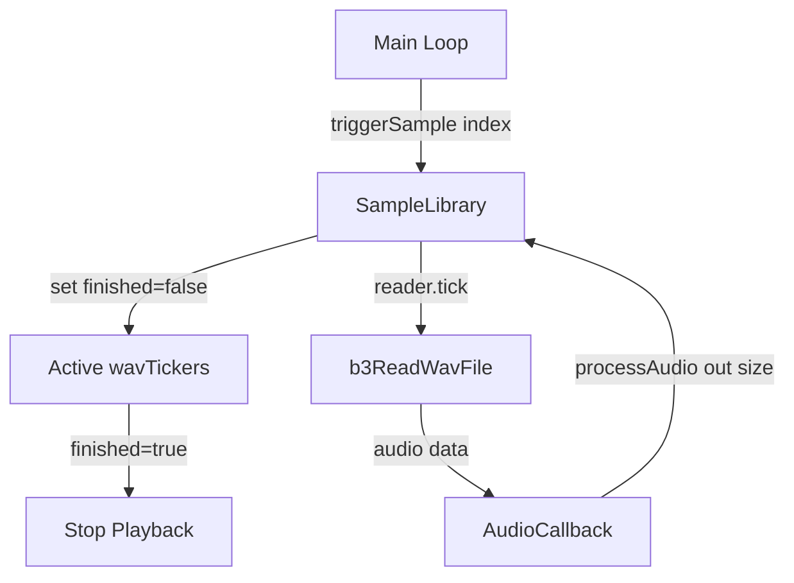

# Simple WAV Playback Implementation Plan

## Overview
Rewrite the `AudioTickCallback` function to work within the `SampleLibrary.cpp` setup, providing simple WAV playback without any extra controls, knobs, encoders, etc.

## Requirements Summary
- **Triggering**: Samples triggered manually from main loop via a new method
- **Playback**: One-shot playback (stops completely when finished)
- **Volume**: Fixed at 1.0
- **Speed**: Fixed at 1.0 (normal playback)
- **No controls**: No knobs, encoders, or gate inputs

## Architecture Overview



## Implementation Steps

### Step 1: Add Public Methods to SampleLibrary Header

**File**: `SampleLibrary.h`

Add the following public methods to the `SampleLibrary` class:

```cpp
// Process audio for active samples
// Called from AudioCallback to generate audio output
void processAudio(float** out, size_t size);

// Trigger a sample to start playing
// Returns true if sample was triggered successfully
bool triggerSample(int index);

// Stop a currently playing sample
// Returns true if sample was stopped successfully
bool stopSample(int index);
```

### Step 2: Implement processAudio() Method

**File**: `SampleLibrary.cpp`

The `processAudio()` method will:
1. Clear all output buffers to zero
2. Count active voices (non-finished tickers)
3. For each active ticker:
   - Call `samples_[i].reader.tick()` with:
     - Fixed speed: 1.0
     - Fixed volume: 1.0
     - Output buffers: `out[0]` and `out[1]`
   - Handle finished state by setting `finished_ = true`

### Step 3: Implement triggerSample() Method

**File**: `SampleLibrary.cpp`

The `triggerSample()` method will:
1. Validate index bounds
2. Reset the ticker:
   - Set `time_ = starttime_`
   - Set `finished_ = false`
3. Return true on success, false on invalid index

### Step 4: Implement stopSample() Method (Optional Helper)

**File**: `SampleLibrary.cpp`

The `stopSample()` method will:
1. Validate index bounds
2. Set `wavTickers[index].finished_ = true`
3. Return true on success, false on invalid index

### Step 5: Update AudioCallback in SimpleSampler.cpp

**File**: `SimpleSampler.cpp`

Replace the empty `AudioCallback` with:

```cpp
void AudioCallback(AudioHandle::InputBuffer in,
                   AudioHandle::OutputBuffer out,
                   size_t size)
{
    // Process audio for all active samples
    library->processAudio(out, size);
}
```

## Key Implementation Details

### Ticker State Management
- `finished_ = true`: Sample is not playing
- `finished_ = false`: Sample is actively playing
- When a sample finishes, `finished_` is set to `true`

### Audio Processing Loop
```cpp
void SampleLibrary::processAudio(float** out, size_t size) {
    // Clear output buffers
    for (size_t i = 0; i < size; i++) {
        out[0][i] = 0.0f;
        out[1][i] = 0.0f;
    }
    
    // Process each active sample
    for (int i = 0; i < sampleCount_; i++) {
        if (!wavTickers[i].finished_) {
            samples_[i].reader.tick(
                &wavTickers[i],
                samples_[i].dataSource,
                1.0,  // speed
                1.0,  // volume
                size,
                out[0],
                out[1]
            );
            
            // If finished, mark as done
            if (wavTickers[i].finished_) {
                // Already set by tick(), no action needed
            }
        }
    }
}
```

### Trigger Implementation
```cpp
bool SampleLibrary::triggerSample(int index) {
    if (index < 0 || index >= sampleCount_) {
        return false;
    }
    
    // Reset ticker to start position
    wavTickers[index].time_ = wavTickers[index].starttime_;
    wavTickers[index].finished_ = false;
    
    return true;
}
```

## Usage Example

From the main loop in `SimpleSampler.cpp`:

```cpp
// Trigger sample 0 to start playing
library->triggerSample(0);

// Stop sample 0
library->stopSample(0);
```

## Notes
- The `b3ReadWavFile::tick()` method automatically sets `finished_` when the sample reaches the end
- Multiple samples can play simultaneously (polyphonic playback)
- Output is mixed by summing contributions from all active samples
- No active voice limiting is applied (unlike the original code which clamped at 20)
