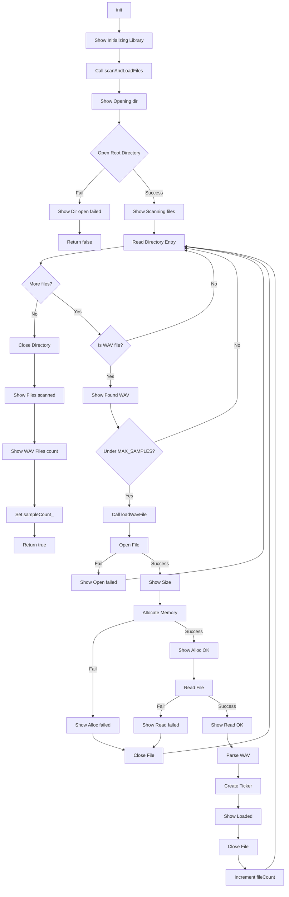

# Task 11: Refactor SampleLibrary::init() into Smaller Functions

## Overview
This task refactors the 110-line `init()` method in [`SampleLibrary.cpp`](../SampleLibrary.cpp:26-136) into smaller, more manageable helper functions to improve code readability and maintainability.

## Current Implementation Analysis

### Current `init()` Structure (lines 26-136)
The current `init()` function handles multiple responsibilities:
1. Display initialization messages
2. Open root directory
3. Scan for WAV files
4. Load each WAV file (open, read, parse, create ticker)
5. Display progress messages throughout
6. Close directory
7. Display final summary

### Key Variables Used
- `extern FIL SDFile` - Global file handle (defined in SimpleSampler.cpp)
- `DIR dir` - Directory handle
- `FILINFO fno` - File information structure
- `FRESULT result` - FatFS result code
- `int fileCount` - Counter for loaded files

## Issues with Proposed Refactoring (from refactor.md)

### Issue 1: `openDirectory()` is Redundant and Flawed
The proposed `openDirectory()` function declares a local `DIR dir` variable, opens the directory, and returns `true`. However, the `dir` variable goes out of scope when the function returns, so the directory handle is lost. The `scanAndLoadFiles()` function would then need to open its own directory handle anyway.

### Issue 2: `loadWavFile()` Shadows Global `SDFile`
The current code uses `extern FIL SDFile` (declared at line 5 in SampleLibrary.cpp). The proposed `loadWavFile()` declares its own local `FIL SDFile`, which shadows the global. This inconsistency could cause confusion.

### Issue 3: Missing Display Message
The original code shows "Opening dir..." message at line 33, but the proposed simplified `init()` doesn't include this message.

## Refined Design Approach

### Recommended Helper Functions

Instead of the three functions proposed in refactor.md, this design uses **two helper functions**:

1. **`loadWavFile(const char* filename, int index)`**
   - Handles loading a single WAV file
   - Uses the global `extern FIL SDFile` for consistency
   - Returns `true` on success, `false` on failure

2. **`scanAndLoadFiles()`**
   - Opens the root directory
   - Scans for WAV files
   - Calls `loadWavFile()` for each WAV found
   - Updates `sampleCount_`
   - Returns `true` on success, `false` on failure

### Rationale for Two-Function Design
- The `openDirectory()` function doesn't add value since the directory handle cannot be returned
- Directory opening is naturally part of the scanning process
- This design maintains the same display messages and behavior as the original code

## Implementation Plan

### Step 1: Add Helper Method Declarations to SampleLibrary.h

Add these private helper methods to the `SampleLibrary` class (in the private section, after the existing helper methods around line 46):

```cpp
// Helper: Scan directory and load all WAV files
bool scanAndLoadFiles();

// Helper: Load a single WAV file
bool loadWavFile(const char* filename, int index);
```

**Location**: [`SampleLibrary.h`](../SampleLibrary.h:46) - Add after line 46

### Step 2: Implement `loadWavFile()` in SampleLibrary.cpp

Create the `loadWavFile()` helper function. This function:
- Uses the global `extern FIL SDFile` (don't declare a local one)
- Opens the file
- Allocates memory from custom pool
- Reads file contents
- Parses WAV header
- Creates ticker
- Displays all progress messages

**Key Implementation Details:**
- Use `custom_pool_allocate()` for memory allocation
- Use `f_open()`, `f_read()`, `f_close()` with global `SDFile`
- Copy filename using `strncpy()` with proper bounds checking
- Set `loaded` and `audioDataLoaded` to `true`
- Initialize `finished_` to `true` for the ticker
- Return `false` on any error, `true` on success

**Location**: [`SampleLibrary.cpp`](../SampleLibrary.cpp:137) - Add after `init()` function (before `getSample()`)

### Step 3: Implement `scanAndLoadFiles()` in SampleLibrary.cpp

Create the `scanAndLoadFiles()` helper function. This function:
- Shows "Opening dir..." message
- Opens the root directory
- Shows "Scanning files..." message
- Reads directory entries in a loop
- For each WAV file found:
  - Shows "Found WAV:" message
  - Calls `loadWavFile()` if under MAX_SAMPLES limit
  - Increments fileCount on success
- Closes the directory
- Shows "Files scanned" message
- Shows "WAV Files: X" summary message
- Stores fileCount in `sampleCount_`
- Returns `true` on success, `false` if directory open fails

**Key Implementation Details:**
- Check for `.wav` and `.WAV` extensions using `strstr()`
- Stop scanning if `fno.fname[0] == 0` (no more files)
- Check `fileCount < Constants::SampleLibrary::MAX_SAMPLES`
- Always call `f_closedir()` even if errors occur

**Location**: [`SampleLibrary.cpp`](../SampleLibrary.cpp:137) - Add after `loadWavFile()` implementation

### Step 4: Simplify `init()` in SampleLibrary.cpp

Replace the entire `init()` method body (lines 26-136) with a simplified version that:
- Shows "Initializing Library..." message
- Calls `scanAndLoadFiles()`
- Returns the result from `scanAndLoadFiles()`

**Location**: [`SampleLibrary.cpp`](../SampleLibrary.cpp:26-136)

## Display Messages to Preserve

The refactoring must preserve all existing display messages in their original order:

1. "Initializing Library..." (200ms)
2. "Opening dir..." (200ms)
3. "Dir open failed!" (200ms) - on error
4. "Scanning files..." (200ms)
5. "Found WAV: <filename>" (200ms) - per file
6. "Size: <n> bytes" (200ms) - per file
7. "Alloc OK, reading..." (200ms) - per file
8. "Read OK, parsing..." (200ms) - per file
9. "Parsed OK, creating ticker..." (200ms) - per file
10. "Ticker created!" (200ms) - per file
11. "Loaded: <filename>" (200ms) - per file
12. "Alloc failed!" (200ms) - per file error
13. "Read failed!" (200ms) - per file error
14. "Open failed!" (200ms) - per file error
15. "Files scanned" (300ms)
16. "WAV Files: <n>" (200ms)

## Error Handling

The refactoring must maintain the same error handling behavior:

1. If directory open fails: show "Dir open failed!" and return `false`
2. If file open fails: show "Open failed!" and continue to next file
3. If memory allocation fails: show "Alloc failed!" and continue to next file
4. If file read fails: show "Read failed!" and continue to next file
5. Always close the file handle if it was opened

## Testing Checklist

After implementation, verify:

- [ ] Code compiles without errors: `make clean && make`
- [ ] No new warnings are introduced
- [ ] All display messages appear in the same order as before
- [ ] WAV files are loaded correctly
- [ ] Error handling works as expected (try with no SD card, no WAV files, corrupted files)
- [ ] `sampleCount_` is set correctly
- [ ] All samples are marked as loaded
- [ ] Tickers are created correctly
- [ ] Audio playback still works: `make program` and test on hardware

## Architecture Diagram



## Files to Modify

1. [`SampleLibrary.h`](../SampleLibrary.h) - Add private helper method declarations
2. [`SampleLibrary.cpp`](../SampleLibrary.cpp) - Implement helper functions and simplify `init()`

## Summary

This refactoring breaks down the 110-line `init()` method into:
- A simplified `init()` (approximately 10 lines)
- A `scanAndLoadFiles()` helper (approximately 40 lines)
- A `loadWavFile()` helper (approximately 50 lines)

The design preserves all existing functionality, display messages, and error handling while improving code organization and readability.
