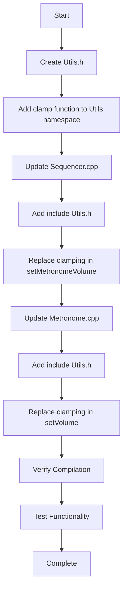

# Task 13: Create Utility Helper for Clamping - Implementation Plan

## Overview
This refactoring task creates a utility header with a `clamp()` function to eliminate duplicate clamping logic in [`Sequencer.cpp`](Sequencer.cpp:220-230) and [`Metronome.cpp`](Metronome.cpp:73-83).

## Current State Analysis

### Duplicate Clamping Logic Found

#### 1. Sequencer.cpp - setMetronomeVolume() (Lines 220-230)
```cpp
void Sequencer::setMetronomeVolume(float volume)
{
    // Clamp volume to valid range
    if (volume < 0.0f) {
        volume = 0.0f;
    } else if (volume > 1.0f) {
        volume = 1.0f;
    }

    state_.metronomeVolume = volume;
}
```

#### 2. Metronome.cpp - setVolume() (Lines 73-83)
```cpp
void Metronome::setVolume(float volume)
{
    // Clamp volume to valid range
    if (volume < 0.0f) {
        volume_ = 0.0f;
    } else if (volume > 1.0f) {
        volume_ = 1.0f;
    } else {
        volume_ = volume;
    }
}
```

### Additional Clamping Logic (Out of Scope)
- [`Sequencer.cpp:32-45`](Sequencer.cpp:32-45) - `setBpm()` uses similar clamping pattern with `Constants::UI::MIN_BPM` and `Constants::UI::MAX_BPM`
- This is NOT included in Task 13 scope per refactor.md

## Proposed Solution

### Create Utils.h
A new header file containing a reusable `clamp()` function within the `Utils` namespace.

```cpp
#pragma once

namespace Utils {
    /**
     * Clamp a value between min and max
     * @param value The value to clamp
     * @param min Minimum allowed value
     * @param max Maximum allowed value
     * @return The clamped value
     */
    inline float clamp(float value, float min, float max) {
        return (value < min) ? min : (value > max) ? max : value;
    }
}
```

### Design Decisions

1. **Use `#pragma once`**: Consistent with project standard (Task 4 completed)
2. **Use `inline` keyword**: Essential for header-only function definitions to avoid linker errors
3. **Use namespace `Utils`**: Consistent with project pattern (e.g., `Constants` namespace)
4. **Ternary operator implementation**: Efficient, concise, and commonly used pattern
5. **Float-only signature**: Sufficient for current use cases (volume clamping)

## Implementation Steps

### Step 1: Create Utils.h
- Create new file `Utils.h` in project root directory
- Add `#pragma once` include guard
- Define `Utils` namespace with `clamp()` function
- Add documentation comment

### Step 2: Update Sequencer.cpp
- Add `#include "Utils.h"` at the top of the file (after existing includes)
- In `setMetronomeVolume()` method (lines 220-230):
  - Replace lines 223-227 (the if-else clamping logic) with:
    ```cpp
    state_.metronomeVolume = Utils::clamp(volume, 0.0f, 1.0f);
    ```
  - Remove the comment "Clamp volume to valid range" (now redundant)

### Step 3: Update Metronome.cpp
- Add `#include "Utils.h"` at the top of the file (after existing includes)
- In `setVolume()` method (lines 73-83):
  - Replace lines 75-82 (the if-else clamping logic) with:
    ```cpp
    volume_ = Utils::clamp(volume, 0.0f, 1.0f);
    ```
  - Remove the comment "Clamp volume to valid range" (now redundant)

## Verification Steps

After implementation, verify:
1. Code compiles without errors: `make clean && make`
2. No new warnings are introduced
3. Volume clamping behavior is unchanged (test with values below 0.0f, above 1.0f, and in range)
4. No linker errors related to multiple definitions

## Potential Issues and Mitigations

| Issue | Mitigation |
|-------|------------|
| Missing `inline` keyword causing linker errors | Ensure `inline` keyword is present in function declaration |
| Include guard inconsistency | Use `#pragma once` to match project standard |
| Function name conflicts | Use `Utils` namespace to avoid naming collisions |
| Type mismatch with constants | All current uses are float, no conversion needed |

## Files Summary

| Action | File | Description |
|--------|------|-------------|
| Create | `Utils.h` | New utility header with clamp function |
| Modify | `Sequencer.cpp` | Add include, replace clamping logic in setMetronomeVolume() |
| Modify | `Metronome.cpp` | Add include, replace clamping logic in setVolume() |

## Mermaid Diagram: Refactoring Workflow



## Testing Considerations

1. **Boundary Testing**:
   - Test with volume = -0.5f (should clamp to 0.0f)
   - Test with volume = 0.0f (should remain 0.0f)
   - Test with volume = 0.5f (should remain 0.5f)
   - Test with volume = 1.0f (should remain 1.0f)
   - Test with volume = 1.5f (should clamp to 1.0f)

2. **Integration Testing**:
   - Verify metronome volume control still works correctly
   - Verify sequencer metronome volume control still works correctly

## Future Considerations

1. **Template Version**: Consider adding a template version of `clamp()` for other numeric types (int, double) if needed
2. **Additional Utilities**: `Utils.h` could be expanded with other common utility functions in future tasks
3. **BPM Clamping**: The BPM clamping in `Sequencer::setBpm()` could use this utility in a future refactoring (not part of Task 13)
