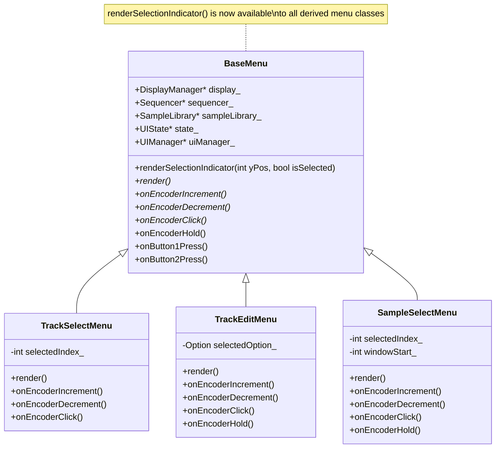

# Task 14: Extract Selection Indicator Rendering - Implementation Plan

## Overview
This task refactors duplicate selection indicator rendering code in [`Menus.cpp`](../Menus.cpp) by extracting it into a reusable helper function in the `BaseMenu` class.

## Analysis Summary

### Current State
Four locations in [`Menus.cpp`](../Menus.cpp) contain identical selection indicator rendering logic:

| Location | Lines | Menu Class | Selection Condition |
|----------|-------|------------|---------------------|
| 1 | 30-36 | [`TrackSelectMenu::render()`](../Menus.cpp:17) | `i == selectedIndex_` |
| 2 | 120-126 | [`TrackEditMenu::render()`](../Menus.cpp:95) | `selectedOption_ == Option::Sample` |
| 3 | 134-140 | [`TrackEditMenu::render()`](../Menus.cpp:95) | `selectedOption_ == Option::Sequence` |
| 4 | 239-245 | [`SampleSelectMenu::render()`](../Menus.cpp:216) | `sampleIndex == selectedIndex_` |

### Current Pattern (Repeated 4 times)
```cpp
if (/* selection condition */) {
    display_->setCursor(0, yPos);
    display_->writeString(">", Font_7x10);
} else {
    display_->setCursor(0, yPos);
    display_->writeString(" ", Font_7x10);
}
```

### Other Similar Patterns (NOT included in this refactoring)
- [`SequenceEditorMenu::render()`](../Menus.cpp:344) lines 363-367, 376-380: Uses "X"/"." for step active/inactive states
- [`SequenceEditorMenu::render()`](../Menus.cpp:344) line 389: Uses "^" for selected step indicator

These are intentionally different patterns for different UI elements and should NOT be changed.

## Implementation Plan

### Step 1: Add Helper Method Declaration to BaseMenu
**File**: [`UIManager.h`](../UIManager.h)
**Location**: After line 83 (after `UIManager* uiManager_;`), in the `protected:` section

Add the following declaration:
```cpp
// Helper: Render selection indicator
void renderSelectionIndicator(int yPos, bool isSelected);
```

**Verification**: The `BaseMenu` class (lines 77-113) already has:
- `protected:` section starting at line 78
- `display_` member available for use
- Access to `Font_7x10` (globally available)

### Step 2: Implement Helper Function in Menus.cpp
**File**: [`Menus.cpp`](../Menus.cpp)
**Location**: After the `#include` directives (after line 4), before the `TrackSelectMenu` implementation

Add the following implementation:
```cpp
// ============================================================================
// BaseMenu Helper Functions
// ============================================================================

void BaseMenu::renderSelectionIndicator(int yPos, bool isSelected)
{
    display_->setCursor(0, yPos);
    display_->writeString(isSelected ? ">" : " ", Font_7x10);
}
```

### Step 3: Replace TrackSelectMenu Selection Indicator
**File**: [`Menus.cpp`](../Menus.cpp)
**Location**: Lines 30-36 in [`TrackSelectMenu::render()`](../Menus.cpp:17)

**Before**:
```cpp
// Show selection indicator
if (i == selectedIndex_) {
    display_->setCursor(0, yPos);
    display_->writeString(">", Font_7x10);
} else {
    display_->setCursor(0, yPos);
    display_->writeString(" ", Font_7x10);
}
```

**After**:
```cpp
// Show selection indicator
renderSelectionIndicator(yPos, i == selectedIndex_);
```

### Step 4: Replace First TrackEditMenu Selection Indicator
**File**: [`Menus.cpp`](../Menus.cpp)
**Location**: Lines 120-126 in [`TrackEditMenu::render()`](../Menus.cpp:95)

**Before**:
```cpp
// Sample option
if (selectedOption_ == Option::Sample) {
    display_->setCursor(0, yPos);
    display_->writeString(">", Font_7x10);
} else {
    display_->setCursor(0, yPos);
    display_->writeString(" ", Font_7x10);
}
```

**After**:
```cpp
// Sample option
renderSelectionIndicator(yPos, selectedOption_ == Option::Sample);
```

### Step 5: Replace Second TrackEditMenu Selection Indicator
**File**: [`Menus.cpp`](../Menus.cpp)
**Location**: Lines 134-140 in [`TrackEditMenu::render()`](../Menus.cpp:95)

**Before**:
```cpp
// Sequence option
yPos = 24;
if (selectedOption_ == Option::Sequence) {
    display_->setCursor(0, yPos);
    display_->writeString(">", Font_7x10);
} else {
    display_->setCursor(0, yPos);
    display_->writeString(" ", Font_7x10);
}
```

**After**:
```cpp
// Sequence option
yPos = 24;
renderSelectionIndicator(yPos, selectedOption_ == Option::Sequence);
```

### Step 6: Replace SampleSelectMenu Selection Indicator
**File**: [`Menus.cpp`](../Menus.cpp)
**Location**: Lines 239-245 in [`SampleSelectMenu::render()`](../Menus.cpp:216)

**Before**:
```cpp
// Show selection indicator
if (sampleIndex == selectedIndex_) {
    display_->setCursor(0, yPos);
    display_->writeString(">", Font_7x10);
} else {
    display_->setCursor(0, yPos);
    display_->writeString(" ", Font_7x10);
}
```

**After**:
```cpp
// Show selection indicator
renderSelectionIndicator(yPos, sampleIndex == selectedIndex_);
```

## Architecture Diagram



## Verification Steps

After implementation, verify:
1. Code compiles without errors: `make clean && make`
2. All four menus render correctly with selection indicators
3. No visual changes in the UI (identical behavior)
4. All menu navigation works as expected

## Risk Assessment

| Risk | Likelihood | Impact | Mitigation |
|------|------------|--------|------------|
| Syntax error in helper function | Low | Low | Simple implementation, follows existing patterns |
| Incorrect replacement | Low | Medium | Careful line-by-line replacement |
| Breaking existing functionality | Very Low | High | No logic changes, only code extraction |

## Notes
- This is a pure refactoring with no functional changes
- The helper function uses a ternary operator for conciseness
- All derived menu classes automatically gain access to the helper
- The pattern is consistent across all four locations
