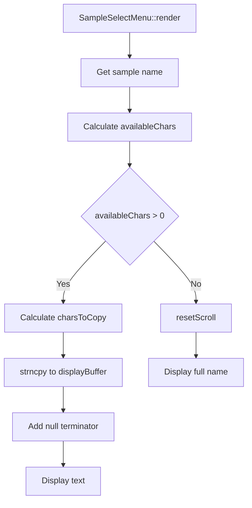

# Task 15: Use strncpy for Scrolling Text - Implementation Plan

## Overview
Replace manual character copying loop with `strncpy` for scrolling text in `SampleSelectMenu::render()` method in `Menus.cpp`.

## Current Implementation
**File**: [`Menus.cpp`](Menus.cpp:252-255)

```cpp
// Copy characters starting from scroll offset
for (int j = 0; j < charsToCopy; j++) {
    displayBuffer[j] = sampleName[state_->scrollOffset + j];
}
displayBuffer[charsToCopy] = '\0';
```

## Proposed Implementation
```cpp
strncpy(displayBuffer, sampleName + state_->scrollOffset, charsToCopy);
displayBuffer[charsToCopy] = '\0';
```

## Analysis

### Why This Change is Appropriate

1. **Standard Library Function**: `strncpy` is a standard C library function designed for safe character copying
2. **Already Included**: `<string.h>` is already included at line 4 of [`Menus.cpp`](Menus.cpp:4)
3. **Pointer Arithmetic**: `sampleName + state_->scrollOffset` correctly points to the starting character for scrolling
4. **Explicit Null Termination**: The null terminator is still explicitly added because `strncpy` does not guarantee null termination when the source is longer than n characters

### Buffer Safety Analysis

| Buffer | Size | Usage | Safety Status |
|--------|------|-------|---------------|
| `displayBuffer` | 32 chars | Local stack buffer | Safe - charsToCopy clamped to 18 |
| `sample->name` | 32 chars | Source string from SampleInfo | Safe - guaranteed valid |

**Bounds Checking**: `charsToCopy` is calculated as:
```cpp
int charsToCopy = (availableChars > Constants::Display::MAX_CHARS_PER_LINE) 
                  ? Constants::Display::MAX_CHARS_PER_LINE 
                  : availableChars;
```
Where `MAX_CHARS_PER_LINE = 128 / 7 = 18` (from [`Constants.h`](Constants.h:12))

Since `charsToCopy` is clamped to 18 and `displayBuffer` is 32 characters, there is no risk of buffer overflow.

### strncpy Behavior Notes

- If source length >= n: Copies exactly n characters, does NOT add null terminator
- If source length < n: Copies all characters and pads remaining with null characters

**Conclusion**: The explicit null terminator after `strncpy` is necessary and correct.

### Edge Cases Considered

| Edge Case | Behavior | Safe? |
|-----------|----------|-------|
| `scrollOffset` = 0 | Copies from beginning of string | Yes |
| `scrollOffset` near end of string | Copies remaining chars (availableChars < MAX_CHARS_PER_LINE) | Yes |
| `scrollOffset` beyond name length | Handled by `resetScroll()` at line 261 | Yes |
| Empty sample name | Copies 0 chars, adds null terminator | Yes |

### Other Similar Patterns
No other instances of manual character copying found in the codebase. This is the only location requiring this refactoring.

## Implementation Steps

1. **Open** [`Menus.cpp`](Menus.cpp)
2. **Navigate to** `SampleSelectMenu::render()` method (around line 208)
3. **Locate** the manual character copying loop at lines 252-255:
   ```cpp
   // Copy characters starting from scroll offset
   for (int j = 0; j < charsToCopy; j++) {
       displayBuffer[j] = sampleName[state_->scrollOffset + j];
   }
   displayBuffer[charsToCopy] = '\0';
   ```
4. **Replace** with the `strncpy` version:
   ```cpp
   strncpy(displayBuffer, sampleName + state_->scrollOffset, charsToCopy);
   displayBuffer[charsToCopy] = '\0';
   ```
5. **Verify** the change preserves indentation and surrounding context
6. **Compile** with `make clean && make`
7. **Test** on hardware with `make program`

## Files to Modify
- [`Menus.cpp`](Menus.cpp:252-255)

## Verification Checklist

- [ ] Manual loop replaced with `strncpy`
- [ ] Explicit null terminator preserved
- [ ] Code compiles without errors
- [ ] No new warnings introduced
- [ ] Scrolling text functionality unchanged
- [ ] All sample names display correctly
- [ ] Long names scroll properly
- [ ] Short names display without issues

## Context Diagram



## Notes

- This is a straightforward refactoring that improves code readability
- No functional changes are expected
- The change makes the code more idiomatic C++
- `strncpy` is already available via `<string.h>` included at line 4
