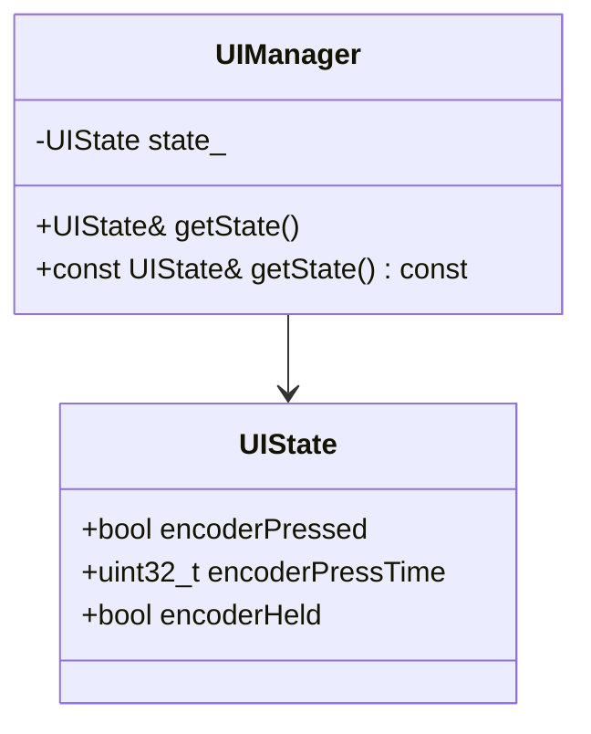

# Task 2: Fix Repeated const_cast Usage - Implementation Plan

## Overview

This task eliminates repeated `const_cast` calls in `SimpleSampler.cpp` by adding a non-const accessor method to the `UIManager` class. This is a code cleanliness improvement that removes a code smell without affecting functionality.

## Current State Analysis

### UIManager.h (Line 180)
Currently has only a const accessor:
```cpp
const UIState& getState() const { return state_; }
```

### SimpleSampler.cpp (Lines 187, 188, 189, 196, 197, 205)
Six locations use `const_cast` to modify UI state:
- **Line 187**: `const_cast<UIState&>(uiManager->getState()).encoderPressed = true;`
- **Line 188**: `const_cast<UIState&>(uiManager->getState()).encoderPressTime = System::GetNow();`
- **Line 189**: `const_cast<UIState&>(uiManager->getState()).encoderHeld = false;`
- **Line 196**: `const_cast<UIState&>(uiManager->getState()).encoderPressed = false;`
- **Line 197**: `const_cast<UIState&>(uiManager->getState()).encoderHeld = false;`
- **Line 205**: `const_cast<UIState&>(uiManager->getState()).encoderHeld = true;`

**Note**: The refactor.md references lines 188-207, but the actual affected lines are 187, 188, 189, 196, 197, and 205.

## Solution Architecture



## Implementation Steps

### Step 1: Add Non-const getState() to UIManager.h

**File**: `UIManager.h`  
**Location**: Line 180 area (public section after `render()`)

**Change**: Replace the single const accessor with both const and non-const overloads:

```cpp
// Get UI state (non-const version for modification)
UIState& getState() { return state_; }

// Get UI state (const version for read-only access)
const UIState& getState() const { return state_; }
```

**Rationale**: This provides proper const-correctness:
- Non-const version allows modification (removes need for const_cast)
- Const version preserves read-only access for const contexts

### Step 2: Replace const_cast Calls in SimpleSampler.cpp

**File**: `SimpleSampler.cpp`  
**Locations**: Lines 187, 188, 189, 196, 197, 205

For each line, replace the `const_cast` pattern with direct accessor:

| Line | Before | After |
|------|--------|-------|
| 187 | `const_cast<UIState&>(uiManager->getState()).encoderPressed = true;` | `uiManager->getState().encoderPressed = true;` |
| 188 | `const_cast<UIState&>(uiManager->getState()).encoderPressTime = System::GetNow();` | `uiManager->getState().encoderPressTime = System::GetNow();` |
| 189 | `const_cast<UIState&>(uiManager->getState()).encoderHeld = false;` | `uiManager->getState().encoderHeld = false;` |
| 196 | `const_cast<UIState&>(uiManager->getState()).encoderPressed = false;` | `uiManager->getState().encoderPressed = false;` |
| 197 | `const_cast<UIState&>(uiManager->getState()).encoderHeld = false;` | `uiManager->getState().encoderHeld = false;` |
| 205 | `const_cast<UIState&>(uiManager->getState()).encoderHeld = true;` | `uiManager->getState().encoderHeld = true;` |

### Step 3: Verify Compilation

After making changes, verify the code compiles:
```bash
make clean && make
```

## Technical Considerations

1. **Function Overloading**: C++ allows overloading based on const qualification. The compiler will automatically select the appropriate version based on the object's constness.

2. **Const-Correctness**: The solution maintains proper const-correctness:
   - Non-const `getState()` is called on non-const `uiManager` object
   - Const `getState()` is preserved for const contexts

3. **No Functional Changes**: This is purely a code cleanliness improvement. The behavior remains identical.

## Files to Modify

1. `UIManager.h` - Add non-const getState() method
2. `SimpleSampler.cpp` - Replace 6 const_cast calls

## Verification Checklist

- [ ] Non-const `getState()` method added to `UIManager.h`
- [ ] All 6 `const_cast` calls replaced in `SimpleSampler.cpp`
- [ ] Code compiles without errors: `make clean && make`
- [ ] No new warnings introduced
- [ ] Refactor.md task 2 marked as complete with `[x]`
