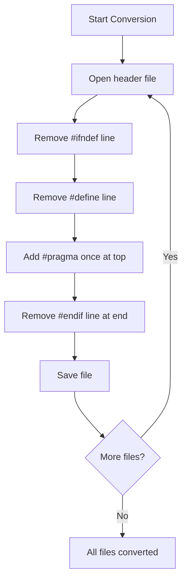

# Task 4: Standardize Include Guards - Implementation Plan

## Overview
Convert all header files from `#ifndef` include guards to `#pragma once` for consistency across the SimpleSampler project.

## Files Already Using #pragma once (No Changes Needed)
- [`Config.h`](Config.h:1) - Already uses `#pragma once`
- [`Constants.h`](Constants.h:1) - Already uses `#pragma once`

## Files to Convert (6 Total)

### 1. UIManager.h
**Current State:**
- Line 1: `#ifndef UI_MANAGER_H`
- Line 2: `#define UI_MANAGER_H`
- Line 189: `#endif // UI_MANAGER_H`

**Required Changes:**
1. Remove line 1 (`#ifndef UI_MANAGER_H`)
2. Remove line 2 (`#define UI_MANAGER_H`)
3. Remove line 189 (`#endif // UI_MANAGER_H`)
4. Add `#pragma once` at the very top of the file (new line 1)

**Result Structure:**
```cpp
#pragma once

#include "DisplayManager.h"
#include "Sequencer.h"
...
```

---

### 2. Menus.h
**Current State:**
- Line 1: `#ifndef MENUS_H`
- Line 2: `#define MENUS_H`
- Line 163: `#endif // MENUS_H`

**Required Changes:**
1. Remove line 1 (`#ifndef MENUS_H`)
2. Remove line 2 (`#define MENUS_H`)
3. Remove line 163 (`#endif // MENUS_H`)
4. Add `#pragma once` at the very top of the file (new line 1)

**Result Structure:**
```cpp
#pragma once

#include "UIManager.h"
#include "DisplayManager.h"
...
```

---

### 3. Sequencer.h
**Current State:**
- Line 1: `#ifndef SEQUENCER_H`
- Line 2: `#define SEQUENCER_H`
- Line 178: `#endif // SEQUENCER_H`

**Required Changes:**
1. Remove line 1 (`#ifndef SEQUENCER_H`)
2. Remove line 2 (`#define SEQUENCER_H`)
3. Remove line 178 (`#endif // SEQUENCER_H`)
4. Add `#pragma once` at the very top of the file (new line 1)

**Result Structure:**
```cpp
#pragma once

#include "b3ReadWavFile.h"
#include "SampleLibrary.h"
...
```

---

### 4. SampleLibrary.h
**Current State:**
- Line 1: `#ifndef SAMPLE_LIBRARY_H`
- Line 2: `#define SAMPLE_LIBRARY_H`
- Line 86: `#endif // SAMPLE_LIBRARY_H`

**Required Changes:**
1. Remove line 1 (`#ifndef SAMPLE_LIBRARY_H`)
2. Remove line 2 (`#define SAMPLE_LIBRARY_H`)
3. Remove line 86 (`#endif // SAMPLE_LIBRARY_H`)
4. Add `#pragma once` at the very top of the file (new line 1)

**Result Structure:**
```cpp
#pragma once

#include "b3ReadWavFile.h"
#include "daisy_core.h"
...
```

---

### 5. DisplayManager.h
**Current State:**
- Line 1: `#ifndef DISPLAY_MANAGER_H`
- Line 2: `#define DISPLAY_MANAGER_H`
- Line 84: `#endif // DISPLAY_MANAGER_H`

**Required Changes:**
1. Remove line 1 (`#ifndef DISPLAY_MANAGER_H`)
2. Remove line 2 (`#define DISPLAY_MANAGER_H`)
3. Remove line 84 (`#endif // DISPLAY_MANAGER_H`)
4. Add `#pragma once` at the very top of the file (new line 1)

**Result Structure:**
```cpp
#pragma once

#include "daisy_pod.h"
#include "dev/oled_ssd130x.h"
...
```

---

### 6. Metronome.h
**Current State:**
- Line 1: `#ifndef METRONOME_H`
- Line 2: `#define METRONOME_H`
- Line 95: `#endif // METRONOME_H`

**Required Changes:**
1. Remove line 1 (`#ifndef METRONOME_H`)
2. Remove line 2 (`#define METRONOME_H`)
3. Remove line 95 (`#endif // METRONOME_H`)
4. Add `#pragma once` at the very top of the file (new line 1)

**Result Structure:**
```cpp
#pragma once

#include "daisysp.h"
...
```

---

## Notes on External Library Files (Not in Scope)
The following files use `#ifndef` guards but are external library files and are NOT part of this refactoring task:
- [`b3ReadWavFile.h`](b3ReadWavFile.h:1) - External library
- [`b3SwapUtils.h`](b3SwapUtils.h:1) - External library

These should remain unchanged as they are third-party code.

---

## Conversion Workflow



---

## Verification Steps (After Implementation)
1. Compile the project: `make clean && make`
2. Verify no compilation errors
3. Verify no warnings introduced
4. Test on Daisy hardware: `make program`
5. Verify all features work as expected

---

## Summary of Changes

| File | Lines to Remove | Line to Add | Total Lines Changed |
|------|-----------------|-------------|---------------------|
| UIManager.h | 1, 2, 189 | 1 (new) | 3 removed, 1 added |
| Menus.h | 1, 2, 163 | 1 (new) | 3 removed, 1 added |
| Sequencer.h | 1, 2, 178 | 1 (new) | 3 removed, 1 added |
| SampleLibrary.h | 1, 2, 86 | 1 (new) | 3 removed, 1 added |
| DisplayManager.h | 1, 2, 84 | 1 (new) | 3 removed, 1 added |
| Metronome.h | 1, 2, 95 | 1 (new) | 3 removed, 1 added |
| **TOTAL** | **18 lines** | **6 lines** | **24 total changes** |

---

## Benefits of #pragma once
- Cleaner, more concise header files
- No need to invent unique macro names
- Less prone to typos (no macro name duplication)
- Modern C++ practice (widely supported by compilers)
- Reduces file size by 2 lines per header
