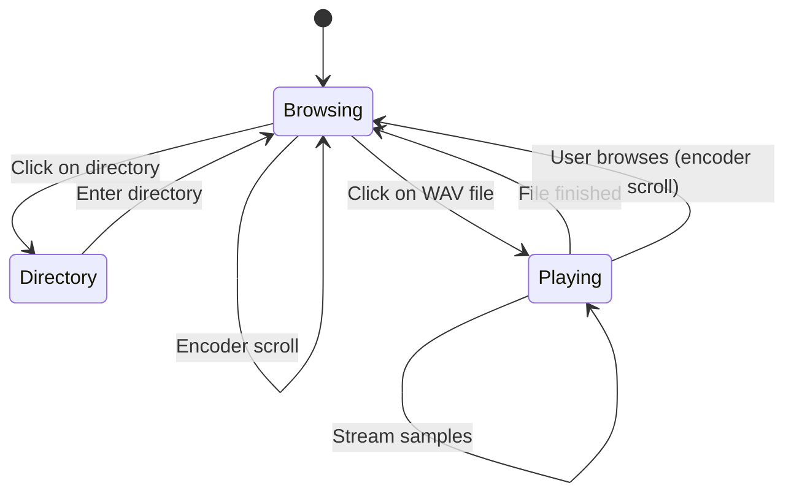

# WAV Player Implementation Plan

## Overview
Add WAV playback functionality to SimpleSampler, allowing users to browse and play WAV files from the SD card using the Daisy Pod's encoder and OLED display.

## User Requirements
- User browses files using the encoder (already implemented)
- Click encoder on a `.wav` file to load and immediately start playing it
- Stop playback when the file finishes (no looping)
- Show the currently playing filename on the OLED during playback

## Technical Approach

### Key Components from WavPlayer Example
The Daisy library provides a `WavPlayer` class with the following key methods:
- `Init(fsi.GetSDPath())` - Initialize the sampler with SD card path
- `Open(index)` - Open a file by index
- `Stream()` - Get next sample (returns int16_t)
- `Prepare()` - Prepare buffers (call in main loop)
- `SetLooping(bool)` - Enable/disable looping
- `GetCurrentFile()` - Get current file index
- `GetNumberFiles()` - Get total number of files

### Audio Processing
- Use `s162f()` helper to convert 16-bit samples to float
- Output samples to both left and right channels
- Handle end-of-file detection to stop playback

## Implementation Steps

### 1. Add WavPlayer Support
- Include necessary headers
- Declare global `WavPlayer` object
- Add playback state variables (isPlaying, currentFilename)

### 2. Audio Callback
- Create `AudioCallback()` function
- Process digital controls in callback
- Stream samples from WavPlayer when playing
- Output silence when not playing

### 3. Main Loop Updates
- Initialize audio engine with appropriate block size
- Start audio callback
- Add `sampler.Prepare()` call in main loop

### 4. File Filtering
- Keep directory navigation intact

### 5. File Selection Logic
- Modify encoder click handler
- If selected file is a directory, enter it (existing behavior)
- If selected file is a `.wav`, load and start playback
- If selected file is not a `.wav`, do nothing

### 6. Display Updates
- Add playback mode to display logic
- When playing, show the currently playing filename
- When browsing, show the file browser

## Workflow Diagram



## Code Structure

### New Global Variables
```cpp
WavPlayer sampler;
bool isPlaying = false;
char currentFilename[32];
```

### Audio Callback Pattern
```cpp
void AudioCallback(AudioHandle::InterleavingInputBuffer in,
                   AudioHandle::InterleavingOutputBuffer out,
                   size_t size)
{
    hw.ProcessDigitalControls();
    
    for(size_t i = 0; i < size; i += 2) {
        if(isPlaying) {
            int16_t sample = sampler.Stream();
            if(sample == 0 && sampler.CheckEndOfFile()) {
                isPlaying = false;
                out[i] = out[i+1] = 0.0f;
            } else {
                out[i] = out[i+1] = s162f(sample) * 0.5f;
            }
        } else {
            out[i] = out[i+1] = 0.0f;
        }
    }
}
```

### Display Modes
- **Browsing Mode**: Show folder name and file list
- **Playing Mode**: Show currently playing filename

## Notes
- The current Makefile already has `USE_FATFS = 1` and `USE_SDRAM = 1`
- SDRAM is beneficial for loading larger audio files
- The `s162f()` function converts 16-bit integer samples to float
- Set looping to false since user wants playback to stop when file ends
